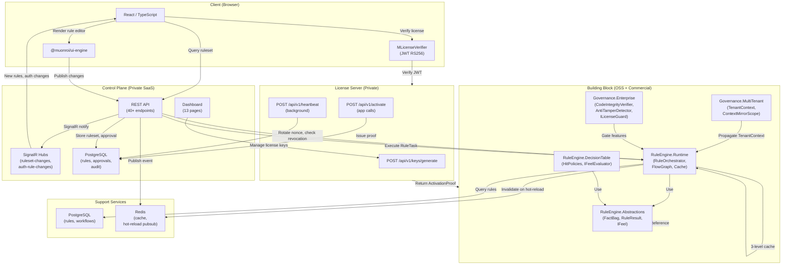

# Architecture Overview

Muonroi is a rule-engine-centric ecosystem designed for enterprise decision automation. This document provides a comprehensive overview of the five core subsystems, their integration points, and the open-core split that enables both OSS and commercial features.

## Ecosystem Scope

The Muonroi ecosystem consists of four repositories:

### Public Open-Source
- **muonroi-building-block** — 54 NuGet packages: rule engine abstractions, runtime orchestration, decision table evaluation, multi-tenancy context, auth/license guards, and ecosystem integrations
- **muonroi-ui-engine** — 8 npm packages: TypeScript UI runtime, 23 Lit custom elements (mu-* prefix), Zustand state management, flow designer, and React hybrid components

### Private Services
- **muonroi-control-plane** — SaaS API (31 MCP tools), dashboard (13 pages), approval workflows, canary deployment, audit trails, and real-time SignalR hubs
- **muonroi-license-server** — RSA-2048 key generation, activation proof issuance, heartbeat management, and feature gating (`MRR-{24-byte}` key format)

---

## 1. Rule Engine Pipeline

The rule engine is the heart of Muonroi. It evaluates and executes rule graphs in a deterministic, quota-aware manner.

### Core Flow

```
User Input
    ↓
RuleOrchestrator.ExecuteAsync(FactBag)
    ↓
RuleGraphParser (Kahn's algorithm) ← topological sort
    ↓
FOR EACH rule in DFS traversal order:
    ├─ Quota check (enforce limits)
    ├─ EvaluateAsync (Phase 1: condition + output fields)
    ├─ ExecuteAsync (Phase 2: side effects)
    └─ Telemetry
    ↓
OrchestratorResult (RuleResults + FactBag mutations)
```

### FactBag — Shared Data Context

A `FactBag` is a `Dictionary<string, object?>` that flows through the entire pipeline. All rules read from and write to it.

- **JSON coercion**: `JsonElement` values are automatically converted to CLR types
- **Graph keys**: Flow graph outputs use prefix `__graph.node.{id}.*` to avoid collisions
- **Immutability during evaluation**: Phase 1 locks writes; Phase 2 applies mutations atomically

### Two-Phase Execution

**Phase 1 — Evaluate:**
- Evaluate rule conditions (FEEL, XPath, custom expressions)
- Compute output fields (no side effects)
- Result: `(passes: bool, outputs: object?)`

**Phase 2 — Execute:**
- Invoke side effects (HTTP calls, DB updates, service integrations)
- Compensate on failure (if enabled)
- Result: `(success: bool, error?: Exception)`

### Execution Modes

| Mode | Behavior | Use Case |
|------|----------|----------|
| **AllOrNothing** | Stop on first failure; no compensation. | Critical workflows (payment, approval) |
| **BestEffort** | Continue on failure; aggregate results. | Notification delivery, analytics |
| **CompensateOnFailure** | Execute all; reverse LIFO on any failure. | Distributed transactions, rollback scenarios |

### Flow Graph — Directed Decision Routing

Rules connect via edges with conditions:

```
Rule A (order > 100)
  ├─ [always] → Rule B (apply discount)
  ├─ [on-true] → Rule C (send confirmation)
  ├─ [on-false] → Rule D (request payment)
  └─ [on-error] → Rule E (log incident)
```

The `GraphRuleDispatchAdapter` routes the next rule based on the current rule's result.

---

## 2. Workflow System

Workflows are multi-step state machines that orchestrate rules, services, and decisions.

### Step Types

A workflow contains up to 256 steps, each of five types:

| Type | Purpose | Next |
|------|---------|------|
| **Start** | Entry point; no logic | → First step |
| **RuleTask** | Execute a rule via RulesEngineService | → Next via execution result |
| **ServiceTask** | Call HTTP, DB, or custom service | → Conditional: success/error |
| **ExclusiveGateway** | Branch on condition (FEEL expression) | → True or False path |
| **End** | Terminate; return final FactBag | (workflow complete) |

### RulesEngineService — Three-Level Cache

When a workflow executes a RuleTask, it loads the rule via a hierarchical cache:

```
1. RuntimeCache
   ├─ per-tenant, TTL (default 5 min)
   ├─ invalidated on SetActiveVersionAsync
   └─ key: {tenantId}:{workflowName}:{version}
       ↓
2. WorkflowCache (static, max 2048 entries)
   ├─ shared across tenants
   └─ LRU eviction
       ↓
3. ReflectionRuleCache
   ├─ per-TContext, parsed FEEL expressions
   ├─ never evicted
   └─ memory trade-off: faster re-evaluation
```

**Cache invalidation flow:**
1. Admin calls `SetActiveVersionAsync(workflowName, version)`
2. RulesEngineService clears RuntimeCache[tenantId]
3. Publishes `RuleSetChangeEvent` to Redis
4. All nodes receive event via SignalR `RuleSetChangeHub`
5. Clients refresh their copy of the rule

### Execution Router — Four Modes

```csharp
enum ExecutionMode {
    Traditional,      // Legacy: steps + rules as-is
    Rules,            // Execute only rule tasks; skip service tasks
    Hybrid,           // Probabilistic: some tenants → Rules, rest → Traditional
    Shadow            // Diff logging: execute both, log divergence, return Traditional result
}
```

The router is selected via `GetExecutionModeForTenant()` and allows gradual migration or A/B testing.

### Canary Deployment

Before executing a RuleTask, the system calls:

```csharp
var version = await GetCanaryVersionForTenantAsync(tenantId, workflowName);
// If tenant is in canary cohort:
//   version = new version (beta)
// Else:
//   version = stable/active version
```

This enables zero-downtime rule updates with tenant-level rollback.

---

## 3. Multi-Tenancy

Muonroi supports isolated multi-tenant deployments with flexible data isolation strategies.

### Context Propagation

On every request, `TenantResolutionMiddleware` extracts the tenant ID and stores it in an `AsyncLocal<TenantContext>`:

```
HTTP Request
  ↓
TenantResolutionMiddleware
  ├─ Read x-tenant-id header
  ├─ or parse from URL path
  ├─ or extract from subdomain
  └─ Validate against JWT claim (401 if mismatch)
    ↓
Set TenantContext.CurrentTenantId (AsyncLocal)
  ↓
All downstream code: TenantContext.CurrentTenantId (no parameter passing needed)
```

### Data Isolation Strategies

| Strategy | Storage | Isolation | Query Filter |
|----------|---------|-----------|--------------|
| **SharedSchema** | Single DB, single schema | Row-level via EF | `WHERE TenantId = @tenantId` |
| **SeparateSchema** | Single DB, schema per tenant | Schema-level | PostgreSQL `SET search_path` |
| **SeparateDatabase** | Isolated DB per tenant | Database-level | Connection string per tenant |

### Entity Framework Integration

All `ITenantScoped` entities automatically apply the tenant filter:

```csharp
// In DbContext.OnModelCreating:
entity.HasQueryFilter(e =>
    e.TenantId == TenantContext.CurrentTenantId ||
    TenantContext.CurrentTenantId == null  // Allow admin queries
);
```

### Quota System

13 quota limits, organized in 4 tier presets:

| Limit | Free | Starter | Professional | Enterprise |
|-------|------|---------|--------------|------------|
| Max Rules | 10 | 100 | 1,000 | Unlimited |
| Max Workflows | 3 | 10 | 50 | Unlimited |
| Requests/Day | 1,000 | 100K | 10M | Unlimited |
| Max Concurrent Rules | 1 | 10 | 100 | Unlimited |
| Decision Tables | 1 | 5 | 50 | Unlimited |
| Custom Expressions | No | No | Yes | Yes |
| Multi-Tenancy | No | No | No | Yes |
| Advanced Auth | No | No | No | Yes |

Quota is cached with key `quota:{tenantId}:{type}:{periodKey}`, invalidated daily.

---

## 4. Auth & License Guard

License verification is enforced at startup and runtime, with anti-tampering measures and feature gating.

### Startup Phase

On application start, a multi-stage verification runs:

```
1. CodeIntegrityVerifier
   ├─ SHA256 hash of loaded assemblies
   ├─ Compare against recorded hashes
   └─ Fail if tampering detected
       ↓
2. AntiTamperDetector
   ├─ Detect debugger attachment
   ├─ Detect code profilers
   ├─ Detect runtime hooks / breakpoints
   └─ Degrade to Free tier on detection
       ↓
3. LicenseActivator
   ├─ Read license key (file or env var)
   ├─ POST to LicenseServer /api/v1/activate
   ├─ Receive signed ActivationProof
   └─ Save proof to local file
```

### Runtime — HMAC Chain Verification

Every runtime check validates an HMAC chain to prevent forged proofs:

```
ActivationProof {
  tier: Enterprise,
  expiresAt: 2027-03-20,
  features: [rule-engine, multi-tenant, advanced-auth],
  hmacChain: [
    {seq: 1, tenant: *, action: activate, signature: SHA256(...)},
    {seq: 2, tenant: *, action: heartbeat, signature: SHA256(...)}
  ]
}

HMAC verification:
  prev_sig = hmacChain[seq-1].signature
  data = "{prev_sig}|{seq}|{tenant}|{action}|{expiry}|{timestamp}"
  key = SHA256(licenseSignature + projectSeed + salt + serverNonce)
  current_sig = HMACSHA256(data, key)
  Assert(current_sig == hmacChain[seq].signature)
```

### Feature Gating

```csharp
public class RuleEngineService {
    public async Task<RuleResult> ExecuteAsync(Fact fact) {
        guard.EnsureFeatureOrThrow("rule-engine");  // Throws if not Enterprise
        guard.EnsureFeatureOrThrow("multi-tenant");  // Throws if tier < Enterprise
        // ... proceed with execution
    }
}
```

Feature checks fail closed: if the license server is unreachable, the app degrades to Free tier after a grace period (default 24h).

### Policy Decision Point (PDP)

Muonroi supports two authorization engines:

- **OpenFGA**: `/v1/check` endpoint for fine-grained access control
- **OPA (Open Policy Agent)**: `/v1/data/authz/allow` for complex policy evaluation

Both are hot-reloaded via SignalR, allowing live policy updates without restart.

---

## 5. UI Engine

The UI engine provides a runtime for rendering rule editors, decision table designers, and flow visualizers in the browser.

### Runtime Initialization

```
MUiEngineRuntime.Create(manifest)
  ├─ Parse manifest schema (v1 or v2)
  ├─ Build 4 indexed maps (O(1) lookup):
  │   ├─ ComponentMap
  │   ├─ ExpressionEngineMap
  │   ├─ DataBindingMap
  │   └─ ValidationRuleMap
  ├─ TTL cache (60s) + ETag HTTP caching
  ├─ SignalR schema watcher for invalidation
  └─ Ready for rendering
```

### Component Library (23 Custom Elements)

All components use the `mu-` prefix and are built with Lit:

- **mu-rule-editor** — Flow designer with node/edge manipulation
- **mu-decision-table** — Virtualized table (44px rows, 45 visible), undo/redo (50-action stack)
- **mu-expression-editor** — FEEL / XPath / custom expression input with autocomplete
- **mu-field-mapper** — Input/output binding configuration
- **mu-version-selector** — Switch between versions, view diffs
- **mu-approval-panel** — View pending approvals, submit/reject
- **mu-audit-trail** — Timeline of changes and approvals
- ... and 16 more

### State Management — Zustand Stores

Each component uses a Zustand vanilla store (no React dependency for core):

```typescript
const useRuleStore = create<RuleState>((set) => ({
  rules: [],
  selectedRule: null,
  setSelectedRule: (id) => set({ selectedRule: id }),
  addRule: (rule) => set((state) => ({
    rules: [...state.rules, rule]
  }))
}));
```

Stores are shared globally but scoped per-license.

### Flow Designer — Lit + React Hybrid

The flow canvas uses Lit for rendering, but the property inspector uses React:

```
<mu-rule-editor>
  ├─ Lit canvas (nodes, edges, drag-drop)
  └─ React property panel (createRoot in shadow DOM)
      ├─ mu-rule-editor → React inspector
      ├─ mu-field-mapper → React binding UI
      └─ mu-approval-panel → React approval form
```

This hybrid approach leverages Lit's performance for the canvas and React's ecosystem for form handling.

### License Gating

In the browser, `MLicenseVerifier` validates the JWT license proof:

```typescript
export async function MLicenseVerifier(token: string): Promise<LicenseClaim> {
  const decoded = jwt.verify(token, PUBLIC_RSA_KEY);  // RS256
  return {
    tier: decoded.tier,
    features: decoded.features,
    expiresAt: decoded.exp
  };
}

export function MCanRenderCommercialFeature(feature: string): boolean {
  const claim = sessionStorage.getItem("license");
  if (!claim) return false;
  const license = JSON.parse(claim) as LicenseClaim;
  return license.features.includes(feature);
}
```

---

## Integration Flow Diagram



---

## Package Dependency Graph

```
RuleEngine.Abstractions (OSS)
  └─ FactBag, RuleResult, IFeelExpression, IRuleAdapter attributes

RuleEngine.Runtime (OSS)
  ├─ RuleOrchestrator, RuleGraphParser (Kahn's algorithm)
  ├─ GraphRuleDispatchAdapter, ExecutionModes
  └─ Depends: RuleEngine.Abstractions

RuleEngine.DecisionTable (OSS)
  ├─ HitPolicies (First, Unique, Collect, Priority)
  ├─ IFeelCellEvaluator, DecisionTableResult
  └─ Depends: RuleEngine.Abstractions

Governance.MultiTenant (OSS)
  ├─ TenantContext (AsyncLocal), ContextMirrorScope
  ├─ ITenantScoped (EF filter marker)
  └─ Depends: RuleEngine.Abstractions

Governance.Enterprise (Commercial)
  ├─ CodeIntegrityVerifier, AntiTamperDetector
  ├─ ILicenseGuard, LicenseActivator
  ├─ HmacChainValidator, ActivationProof
  └─ Depends: RuleEngine.Abstractions, Governance.MultiTenant

RuleEngine.Runtime.Web (Commercial)
  ├─ RulesEngineService (3-level cache, canary)
  ├─ MRuleFlowExecuteController (workflow execution)
  ├─ Hot-reload SignalR hub
  └─ Depends: RuleEngine.Runtime, RuleEngine.DecisionTable, Governance.Enterprise

RuleEngine.DecisionTable.Web (Commercial)
  ├─ DecisionTableController (REST CRUD)
  ├─ DecisionTableVersionService (audit)
  └─ Depends: RuleEngine.DecisionTable, RuleEngine.Runtime.Web

ControlPlane.Api (Private)
  ├─ RulesetApprovalService, CanaryDeploymentService
  ├─ AuditTrailService, PolicyDecisionService (OpenFGA, OPA)
  ├─ 31 MCP tools, 13 dashboard pages
  └─ Depends: RuleEngine.Runtime.Web, RuleEngine.DecisionTable.Web

@muonroi/ui-engine-rule-components (Commercial npm)
  ├─ 23 Lit custom elements (mu-rule-editor, mu-decision-table, etc.)
  ├─ Zustand stores, manifest schema v1/v2
  └─ MLicenseVerifier (browser-side JWT validation)
```

---

## Open-Core Boundary Enforcement

### OSS Packages
Packages in this group may only depend on other OSS packages:
- RuleEngine.Abstractions
- RuleEngine.Runtime
- RuleEngine.DecisionTable
- Governance.MultiTenant
- Core logging, JSON, DateTime abstractions

### Commercial Packages
Packages in this group may depend on OSS packages but not vice versa:
- Governance.Enterprise
- RuleEngine.Runtime.Web
- RuleEngine.DecisionTable.Web
- @muonroi/ui-engine-rule-components (npm)

### Private Services
Only available internally; not published:
- ControlPlane.Api
- License Server

### Enforcement Mechanisms

1. **PowerShell script**: `scripts/check-modular-boundaries.ps1` — validates assembly dependencies at build time
2. **Roslyn analyzers** (MBB001–MBB007):
   - **MBB001**: Enforce `IMDateTimeService` over `DateTime.Now`
   - **MBB002**: Enforce `IMJsonSerializeService` over direct Newtonsoft/System.Text.Json
   - **MBB003**: Enforce `MDbContext` inheritance for data access
   - **MBB004**: Keep `AsyncLocal` confined to execution-context package
   - **MBB005**: Keep abstractions free of infrastructure references (no EF, Serilog, etc.)
   - **MBB006**: Add `EnsureFeatureOrThrow()` to all commercial-only registrations
   - **MBB007**: Use `IMLogContext` instead of direct `LogContext` from Serilog

---

## Key Runtime Dependencies

| Component | Purpose | Status |
|-----------|---------|--------|
| **PostgreSQL** | Ruleset, workflow, decision table persistence; audit trails | Required |
| **Redis** | Cross-node hot-reload publication; ruleset change events | Required |
| **SignalR** | Real-time notifications to dashboards and clients | Required |
| **RSA (2048-bit)** | License key signing, audit trail integrity | Required |
| **OpenFGA / OPA** | Optional PDP; if absent, falls back to RBAC | Optional |

---

## Next Steps

For deeper understanding of individual subsystems, see:

- **[Rule Engine Guide](./rule-engine-guide.md)** — Detailed walk-through of rule evaluation, graph routing, and compensation
- **[Multi-Tenancy Guide](./multi-tenancy-guide.md)** — Data isolation strategies, context propagation, quota enforcement
- **[License Activation](./license-activation.md)** — Key generation, activation proof, heartbeat, and revocation
- **[UI Engine Architecture](./ui-engine-architecture.md)** — Component library, Zustand stores, flow designer, licensing in the browser
- **[Control Plane Overview](./control-plane-overview.md)** — API structure, approval workflows, canary deployment, audit trails
