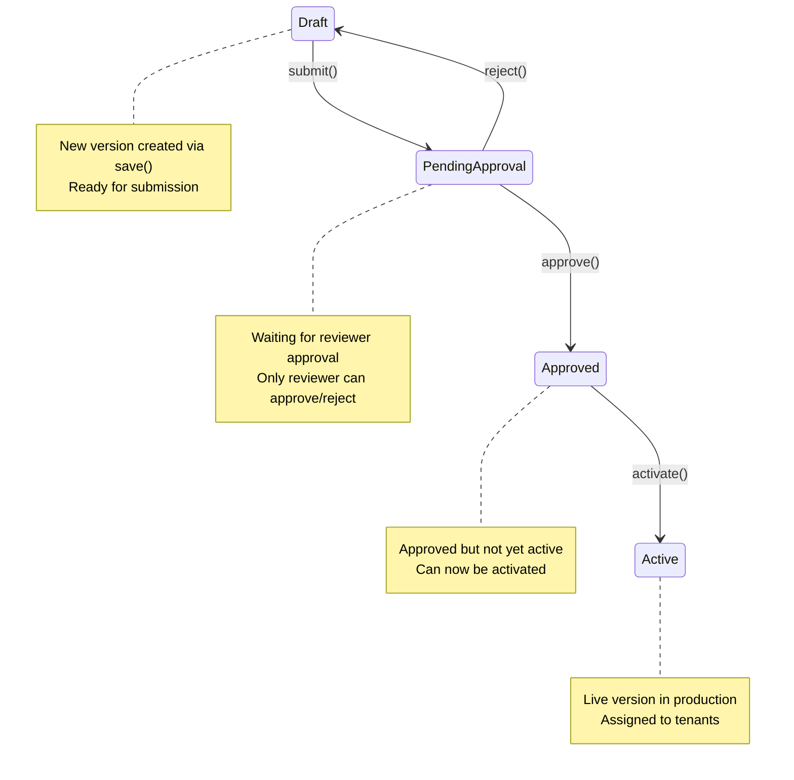

# Ruleset Approval Workflow

The control plane implements a **maker-checker approval pattern** for ruleset releases. This ensures that rule changes are reviewed and approved by a different actor before activation, enforcing separation of duties and audit compliance.

## Configuration

The approval workflow is controlled by the `RuleControlPlane:RequireApproval` flag in
`appsettings.json`:

```json
{
  "RuleControlPlane": {
    "RequireApproval": true
  }
}
```

| Value | Behavior |
|-------|----------|
| `true` (default) | Full maker-checker cycle enforced: save → submit → approve → activate |
| `false` | Save + activate skip the submit/approve cycle; use in dev or CI only |

Environment variable override: `RuleControlPlane__RequireApproval=false`

> **Production rule:** keep `RequireApproval=true` in production. Setting it to `false` disables
> the separation-of-duties guarantee and the submit/approve endpoints become no-ops. The approval
> endpoints documented below are only active when `RequireApproval=true`.

---

## Overview

The approval workflow enforces:

- **Maker-Checker Pattern**: The actor who submits a ruleset for approval cannot approve it (401 on self-approval)
- **Audit Trail**: All state transitions are captured with timestamps, actor names, and reasons
- **State Machine**: Clear progression from Draft → PendingApproval → Approved → Active (or Rejected)
- **SignalR Broadcasting**: Real-time notifications on approval state changes

## State Machine



## API Endpoints

All endpoints use the base route `/api/v1/control-plane`.

| Endpoint | Method | Body | Purpose |
|----------|--------|------|---------|
| `/rulesets/save` | POST | RuleSet JSON | Create/update version in Draft state |
| `/rulesets/{workflow}/{version}/submit` | POST | actor (optional) | Move to PendingApproval |
| `/rulesets/{workflow}/{version}/approve` | POST | actor (optional) | Move to Approved |
| `/rulesets/{workflow}/{version}/reject` | POST | actor, reason | Revert to Draft with reason |
| `/rulesets/{workflow}/{version}/activate` | POST | actor (optional) | Move Approved → Active |
| `/rulesets/pending-approvals` | GET | — | List all versions awaiting approval |

## Complete Workflow Example

### 1. Save New Ruleset Version

Create or update a ruleset. The new version starts in **Draft** state.

**Request:**
```bash
curl -X POST https://cp.truyentm.xyz/api/v1/control-plane/rulesets/save \
  -H "Content-Type: application/json" \
  -H "Authorization: Bearer <jwt_token>" \
  -d '{
    "workflowName": "loan-approval",
    "ruleSet": {
      "id": "loan-approval",
      "name": "Loan Approval Rules",
      "version": 3,
      "description": "Credit check and income validation",
      "enabled": true,
      "rules": [
        {
          "id": "rule-1",
          "name": "Check Credit Score",
          "enabled": true,
          "condition": "creditScore >= 700",
          "actions": [
            { "actionType": "SetOutput", "outputName": "creditApproved", "value": true }
          ]
        }
      ]
    },
    "detail": "Added credit score threshold check"
  }'
```

**Response (201 Created):**
```json
{
  "workflowName": "loan-approval",
  "version": 3,
  "status": "Draft",
  "createdAt": "2026-03-20T10:30:00Z",
  "createdBy": "dev@company.com",
  "lastModifiedAt": "2026-03-20T10:30:00Z",
  "changeDetail": "Added credit score threshold check"
}
```

### 2. Submit for Approval

Move the version from **Draft** to **PendingApproval**. The submitting actor is recorded.

**Request:**
```bash
curl -X POST https://cp.truyentm.xyz/api/v1/control-plane/rulesets/loan-approval/3/submit \
  -H "Content-Type: application/json" \
  -H "Authorization: Bearer <jwt_token>" \
  -d '{
    "actor": "dev@company.com"
  }'
```

**Response (200 OK):**
```json
{
  "workflowName": "loan-approval",
  "version": 3,
  "status": "PendingApproval",
  "submittedAt": "2026-03-20T10:35:00Z",
  "submittedBy": "dev@company.com",
  "approvers": ["lead@company.com"],
  "message": "Version 3 is now pending approval"
}
```

### 3. Approve Version

A **different actor** (reviewer/approver) approves the version, moving it to **Approved** state.

**Request:**
```bash
curl -X POST https://cp.truyentm.xyz/api/v1/control-plane/rulesets/loan-approval/3/approve \
  -H "Content-Type: application/json" \
  -H "Authorization: Bearer <jwt_token>" \
  -d '{
    "actor": "lead@company.com"
  }'
```

**Response (200 OK):**
```json
{
  "workflowName": "loan-approval",
  "version": 3,
  "status": "Approved",
  "approvedAt": "2026-03-20T10:40:00Z",
  "approvedBy": "lead@company.com",
  "readyForActivation": true,
  "message": "Version 3 is approved and ready to activate"
}
```

### 4. Activate Version

Move the version from **Approved** to **Active**. This makes it the live version for all tenants (unless canary rollout is active).

**Request:**
```bash
curl -X POST https://cp.truyentm.xyz/api/v1/control-plane/rulesets/loan-approval/3/activate \
  -H "Content-Type: application/json" \
  -H "Authorization: Bearer <jwt_token>" \
  -d '{
    "actor": "lead@company.com",
    "detail": "Activating credit score validation"
  }'
```

**Response (200 OK):**
```json
{
  "workflowName": "loan-approval",
  "version": 3,
  "status": "Active",
  "activatedAt": "2026-03-20T10:45:00Z",
  "activatedBy": "lead@company.com",
  "previousActiveVersion": 2,
  "message": "Version 3 is now the active ruleset"
}
```

SignalR clients subscribed to `RuleSetChangeHub` receive a broadcast notification immediately.

### 5. Reject Version (Alternative Path)

If the reviewer finds issues, they can reject the version, moving it back to **Draft**.

**Request:**
```bash
curl -X POST https://cp.truyentm.xyz/api/v1/control-plane/rulesets/loan-approval/3/reject \
  -H "Content-Type: application/json" \
  -H "Authorization: Bearer <jwt_token>" \
  -d '{
    "actor": "lead@company.com",
    "reason": "Missing edge case for self-employed applicants. Please revise income validation logic."
  }'
```

**Response (200 OK):**
```json
{
  "workflowName": "loan-approval",
  "version": 3,
  "status": "Draft",
  "rejectedAt": "2026-03-20T10:50:00Z",
  "rejectedBy": "lead@company.com",
  "rejectionReason": "Missing edge case for self-employed applicants. Please revise income validation logic.",
  "message": "Version 3 has been rejected and returned to Draft"
}
```

The developer can now edit the ruleset and resubmit.

### 6. List Pending Approvals

Reviewers can see all versions awaiting approval across all workflows.

**Request:**
```bash
curl https://cp.truyentm.xyz/api/v1/control-plane/rulesets/pending-approvals \
  -H "Authorization: Bearer <jwt_token>"
```

**Response (200 OK):**
```json
{
  "items": [
    {
      "workflowName": "loan-approval",
      "version": 3,
      "status": "PendingApproval",
      "submittedAt": "2026-03-20T10:35:00Z",
      "submittedBy": "dev@company.com",
      "changeDetail": "Added credit score threshold check"
    },
    {
      "workflowName": "underwriting",
      "version": 5,
      "status": "PendingApproval",
      "submittedAt": "2026-03-20T10:42:00Z",
      "submittedBy": "dev2@company.com",
      "changeDetail": "Updated risk assessment matrix"
    }
  ],
  "totalCount": 2
}
```

## Maker-Checker (Separation of Duties)

The approval workflow enforces role separation:

- **Developer (Maker)**: Creates and submits rules
- **Reviewer/Lead (Checker)**: Approves or rejects submissions

**Self-approval is rejected:**
```bash
# This will fail with 403 Forbidden
curl -X POST https://cp.truyentm.xyz/api/v1/control-plane/rulesets/loan-approval/3/approve \
  -H "Authorization: Bearer <jwt_token>" \
  -d '{ "actor": "dev@company.com" }'

# Response:
# 403 Forbidden
# {
#   "error": "ActorCannotApprovOwnSubmission",
#   "message": "The actor who submitted version 3 cannot approve it"
# }
```

This enforces:
- ✓ Multiple eyes on rule changes
- ✓ Audit compliance (submitter ≠ approver)
- ✓ Reduced risk of unauthorized changes

## Audit Trail

Every state transition is recorded:

**View audit history for a workflow:**
```bash
curl https://cp.truyentm.xyz/api/v1/control-plane/audit/workflows/loan-approval \
  -H "Authorization: Bearer <jwt_token>"
```

**Response:**
```json
{
  "workflowName": "loan-approval",
  "entries": [
    {
      "timestamp": "2026-03-20T10:45:00Z",
      "action": "Activated",
      "version": 3,
      "actor": "lead@company.com",
      "detail": "Activating credit score validation"
    },
    {
      "timestamp": "2026-03-20T10:40:00Z",
      "action": "Approved",
      "version": 3,
      "actor": "lead@company.com",
      "detail": null
    },
    {
      "timestamp": "2026-03-20T10:35:00Z",
      "action": "Submitted",
      "version": 3,
      "actor": "dev@company.com",
      "detail": null
    },
    {
      "timestamp": "2026-03-20T10:30:00Z",
      "action": "Created",
      "version": 3,
      "actor": "dev@company.com",
      "detail": "Added credit score threshold check"
    }
  ]
}
```

## SignalR Real-Time Notifications

Clients can subscribe to the `RuleSetChangeHub` to receive real-time notifications when approval state changes.

**Client subscription (JavaScript):**
```javascript
import * as signalR from "@microsoft/signalr";

const connection = new signalR.HubConnectionBuilder()
  .withUrl("https://cp.truyentm.xyz/api/v1/signalr/ruleset-changes", {
    headers: { "Authorization": `Bearer ${token}` }
  })
  .withAutomaticReconnect()
  .build();

connection.on("ApprovalStateChanged", (workflow, version, newStatus) => {
  console.log(`${workflow} v${version} → ${newStatus}`);
  // Refresh UI
});

await connection.start();
```

**Event payload:**
```json
{
  "workflowName": "loan-approval",
  "version": 3,
  "newStatus": "Approved",
  "changedAt": "2026-03-20T10:40:00Z",
  "changedBy": "lead@company.com"
}
```

## Error Responses

| Status | Code | Meaning |
|--------|------|---------|
| 400 | `InvalidState` | Version cannot transition to requested state |
| 401 | `Unauthorized` | Missing or invalid authentication |
| 403 | `ActorCannotApproveOwnSubmission` | Submitter attempted self-approval |
| 404 | `RulesetNotFound` | Workflow or version does not exist |
| 409 | `VersionAlreadyActive` | Cannot approve/reject an already active version |

## Integration with Canary Rollout

After activation, you can optionally enable a **canary rollout** to gradually roll out the new version to a subset of tenants.

See [Canary Rollout Guide](./canary-rollout-guide.md) for details.

## Integration with Hot Reload

When a ruleset is activated, the control plane broadcasts a `RuleSetChangeEvent` to all connected runtime instances via SignalR. Runtimes invalidate their version caches and fetch the new active version.

See [SignalR Hot Reload](./signalr-hot-reload.md) for details.

## Next Steps

1. **Save** → Draft state
2. **Submit** → PendingApproval (submitter records the change reason)
3. **Approve or Reject** → Different actor enforces separation of duties
4. **Activate** → Active (broadcast via SignalR, ready for runtime)
5. **(Optional) Canary** → Gradual rollout to specific tenants
6. **Monitor** → Audit trail and real-time notifications

For more details on the control plane, see [Control Plane Overview](./control-plane-overview.md).
