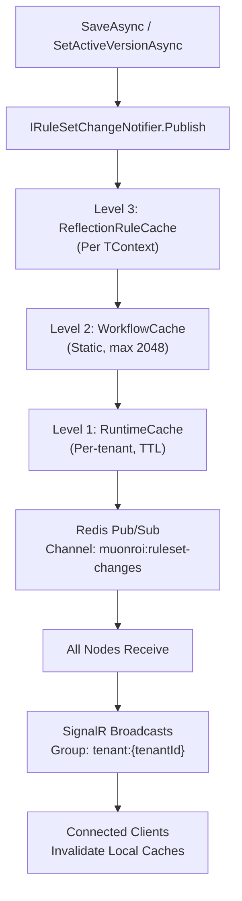

# SignalR Hot Reload

The control plane uses SignalR to broadcast real-time changes to all connected clients and distributed nodes. This enables instant cache invalidation across your entire ecosystem without requiring polling or restart.

## Overview

When you save or activate a ruleset (or modify auth rules), the change is:
1. Persisted to the database
2. Broadcast via SignalR to all connected clients
3. Propagated across all nodes via Redis pub/sub (if enabled)
4. Cached state is invalidated on all consumers

This pattern ensures **zero-downtime updates** and **consistent state** across multi-node deployments.

## RuleSetChangeHub

The primary hub for ruleset changes is hosted at `/hubs/ruleset-changes`.

### Events

The hub broadcasts the following events to subscribed clients:

```csharp
public class RuleSetChangeEvent
{
    public string WorkflowName { get; set; }
    public int Version { get; set; }
    public string Action { get; set; }  // "Saved", "Activated", "Approved"
    public DateTime ChangedAt { get; set; }
    public string ChangedBy { get; set; }
}
```

**Subscription group**: `tenant:{tenantId}` — clients join automatically based on the `x-tenant-id` header.

### Flow

1. **SaveAsync** or **SetActiveVersionAsync** called on ruleset
2. `IRuleSetChangeNotifier` publishes a `RuleSetChangeEvent`
3. `RuleSetHubNotifier` subscribes to the event
4. Event is broadcast to all clients in group `tenant:{tenantId}` via SignalR
5. If Redis is enabled, event is also published to Redis channel `muonroi:ruleset-changes`
6. All nodes listening to Redis receive the event and invalidate their caches
7. All connected clients receive the update and can refresh local caches

## AuthRuleChangeHub

A separate hub at `/hubs/auth-rule-changes` handles authorization rule changes.

### Events

```csharp
public class AuthRuleChangeEvent
{
    public string EventType { get; set; }  // "Created", "Updated", "Deleted"
    public int AuthRuleId { get; set; }
    public string PolicyEngine { get; set; }  // "OpenFGA", "OPA"
    public DateTime ChangedAt { get; set; }
}
```

This hub is primarily used by:
- **License Server** — to hot-reload auth rules used for feature enforcement
- **Control Plane** — to propagate auth rule changes to all nodes
- **Connected dashboards** — to refresh policy enforcement logic

**Subscription group**: `tenant:{tenantId}`

## Client Connection Examples

### TypeScript / JavaScript

```javascript
import * as signalR from "@microsoft/signalr";

const tenantId = "tenant-abc123";

// Connect to RuleSetChangeHub
const ruleSetConnection = new signalR.HubConnectionBuilder()
  .withUrl("https://cp.truyentm.xyz/hubs/ruleset-changes", {
    headers: { "x-tenant-id": tenantId }
  })
  .withAutomaticReconnect([0, 2000, 10000, 30000])  // Exponential backoff
  .build();

// Listen for ruleset changes
ruleSetConnection.on("RuleSetChanged", async (event) => {
  console.log(`Ruleset '${event.workflowName}' v${event.version} ${event.action}`);

  // Invalidate local cache
  await invalidateWorkflowCache(event.workflowName);

  // Optionally refresh UI
  await refreshRulesetList();
});

// Handle reconnection
ruleSetConnection.onreconnected(async (connectionId) => {
  console.log("Reconnected. Refreshing state...");
  await refreshAllCaches();
});

ruleSetConnection.onclose(async (error) => {
  console.error("Connection closed:", error);
});

// Start connection
await ruleSetConnection.start();

// Connect to AuthRuleChangeHub
const authRuleConnection = new signalR.HubConnectionBuilder()
  .withUrl("https://cp.truyentm.xyz/hubs/auth-rule-changes", {
    headers: { "x-tenant-id": tenantId }
  })
  .withAutomaticReconnect()
  .build();

authRuleConnection.on("AuthRuleChanged", async (event) => {
  console.log(`Auth rule ${event.authRuleId} ${event.eventType}`);
  await refreshAuthPolicies();
});

await authRuleConnection.start();

// Cleanup on app shutdown
window.addEventListener("beforeunload", () => {
  ruleSetConnection.stop();
  authRuleConnection.stop();
});
```

### C# / .NET

```csharp
using Microsoft.AspNetCore.SignalR.Client;

var tenantId = "tenant-abc123";

// Create connection to RuleSetChangeHub
var connection = new HubConnectionBuilder()
    .WithUrl("https://cp.truyentm.xyz/hubs/ruleset-changes", options =>
    {
        options.Headers["x-tenant-id"] = tenantId;
    })
    .WithAutomaticReconnect(new[]
    {
        TimeSpan.Zero,
        TimeSpan.FromMilliseconds(2000),
        TimeSpan.FromSeconds(10),
        TimeSpan.FromSeconds(30)
    })
    .Build();

// Subscribe to RuleSetChanged event
connection.On<RuleSetChangeEvent>("RuleSetChanged", async (evt) =>
{
    _logger.LogInformation(
        "Ruleset {WorkflowName} v{Version} {Action}",
        evt.WorkflowName, evt.Version, evt.Action);

    // Invalidate cache
    await _cache.InvalidateAsync($"ruleset:{evt.WorkflowName}");

    // Publish domain event for further handling
    await _mediator.Publish(new RuleSetChangedNotification(evt));
});

// Handle reconnection
connection.Reconnected += async (connectionId) =>
{
    _logger.LogInformation("SignalR reconnected: {ConnectionId}", connectionId);
    await RefreshAllCachesAsync();
};

connection.Closed += async (error) =>
{
    _logger.LogError(error, "SignalR connection closed");
    // Implement retry logic or alert UI
};

// Start the connection
await connection.StartAsync();

// Auth rule changes
var authConnection = new HubConnectionBuilder()
    .WithUrl("https://cp.truyentm.xyz/hubs/auth-rule-changes", options =>
    {
        options.Headers["x-tenant-id"] = tenantId;
    })
    .WithAutomaticReconnect()
    .Build();

authConnection.On<AuthRuleChangeEvent>("AuthRuleChanged", async (evt) =>
{
    _logger.LogInformation("Auth rule {RuleId} {EventType}", evt.AuthRuleId, evt.EventType);
    await _policyCache.InvalidateAsync();
});

await authConnection.StartAsync();

// Ensure graceful shutdown
services.AddHostedService<SignalRConnectionLifecycleService>();
```

## Cache Invalidation Chain

When a ruleset is modified, the following cache layers are invalidated in order:



### Invalidation Steps

| Level | Scope | TTL | Strategy |
|-------|-------|-----|----------|
| **ReflectionRuleCache** | Per-TContext type | Permanent | Cleared on version change |
| **WorkflowCache** | Tenant-wide | Up to 30 min | LRU max 2048 entries |
| **RuntimeCache** | Per-tenant | Configurable | TTL-based expiry + event-based |

When a `RuleSetChangeEvent` is published:

1. **On the publishing node**: All 3 cache levels are cleared before the event is broadcast
2. **On other nodes** (via Redis subscriber): Cache levels 1-3 are cleared upon receiving the event
3. **On connected clients**: Local in-memory caches must be manually invalidated (no automatic sync)

## Redis Configuration

To enable cross-node hot reload, configure Redis in your `appsettings.json`:

```json
{
  "Redis": {
    "ConnectionString": "localhost:6379",
    "InstanceName": "muonroi:",
    "Enabled": true
  }
}
```

### Configuration Options

```json
{
  "Redis": {
    "ConnectionString": "your-redis-host:6379,ssl=false",
    "InstanceName": "muonroi:",
    "Password": "optional-password",
    "Ssl": false,
    "AllowAdmin": false,
    "ConnectTimeout": 5000,
    "SyncTimeout": 5000,
    "Enabled": true,
    "PublishChannels": {
      "RuleSetChanges": "muonroi:ruleset-changes",
      "AuthRuleChanges": "muonroi:auth-rule-changes",
      "WorkflowChanges": "muonroi:workflow-changes"
    }
  }
}
```

### Channel Subscriptions

| Channel | Subscribers | Event Type |
|---------|-------------|-----------|
| `muonroi:ruleset-changes` | All nodes | RuleSetChangeEvent |
| `muonroi:auth-rule-changes` | All nodes + License Server | AuthRuleChangeEvent |
| `muonroi:workflow-changes` | All nodes | WorkflowChangeEvent |

If Redis is disabled, hot reload only works within a single node (in-memory events only).

## Reconnection Strategy

Both hubs employ exponential backoff to handle temporary network failures gracefully.

### Default Reconnect Configuration

```csharp
// Automatic retry intervals: 0ms, 2s, 10s, 30s, then give up
.WithAutomaticReconnect(new[]
{
    TimeSpan.Zero,
    TimeSpan.FromMilliseconds(2000),
    TimeSpan.FromSeconds(10),
    TimeSpan.FromSeconds(30)
})
```

### Handling Missed Events

When a client reconnects after a disconnection, it may have missed events while offline. Best practices:

1. **Refresh on reconnect**: Perform a full cache refresh after reconnection
2. **Validate cache**: Before using cached data, verify its version matches the current server state
3. **Implement polling fallback**: For critical state, implement a periodic polling mechanism as a safety net

```csharp
// Example: Poll every 5 minutes to catch any missed updates
services.AddSingleton<IHostedService>(sp =>
    new CacheValidationPollingService(
        pollingIntervalMinutes: 5,
        cache: sp.GetRequiredService<IRuleSetCache>()
    )
);
```

## Best Practices

### 1. Always Join Tenant Groups

Ensure the `x-tenant-id` header is included on connection:

```javascript
.withUrl(url, {
  headers: { "x-tenant-id": tenantId }
})
```

### 2. Implement Graceful Degradation

If SignalR is unavailable, fall back to periodic HTTP polling:

```csharp
if (connection.State != HubConnectionState.Connected)
{
    // Poll control plane API instead
    var latest = await _httpClient.GetAsync("/api/v1/rulesets/{workflowName}/active");
}
```

### 3. Use Correlation IDs

Track events end-to-end by including correlation IDs:

```csharp
connection.On<RuleSetChangeEvent>("RuleSetChanged", async (evt) =>
{
    using (_logger.BeginScope(new { CorrelationId = evt.CorrelationId }))
    {
        await HandleChangeAsync(evt);
    }
});
```

### 4. Monitor Connection Health

Implement metrics to track SignalR connection uptime:

```csharp
services.AddSingleton<SignalRHealthCheck>();
services.AddHealthChecks()
    .AddCheck<SignalRHealthCheck>("signalr-ruleset", tags: new[] { "ready" });
```

## Wiring in a template

All three Muonroi project templates reference `ControlPlane:SignalRHubPath` in the enterprise `appsettings.json` but do not wire a server-side hub by default. The pattern below is a commented-stub that you can uncomment when enabling the enterprise Control Plane tier.

In `StartupExtensions.cs` (or `ConfigureEndpoints` in the Host project), locate the endpoint mapping block and add:

```csharp
// --- SignalR Hot Reload (enterprise tier) ---
// Uncomment when ControlPlane:RuntimeGovernance:Enabled = true
// and Muonroi.RuleEngine.Runtime.Web is referenced.
//
// app.MapHub<RuleSetChangeHub>(
//     configuration["ControlPlane:SignalRHubPath"] ?? "/hubs/ruleset-changes");
//
// app.MapHub<AuthRuleChangeHub>("/hubs/auth-rule-changes");
```

And in `RegisterService.cs`, inside the enterprise-tier block:

```csharp
// Uncomment together with the hub mapping above.
// builder.Services.AddSignalR();
// builder.Services.AddHostedService<RuleSetHubNotifier>();
// Note: RuleSetHubNotifier (Muonroi.RuleEngine.Runtime.Web) is IHostedService, not IRuleSetChangeNotifier.
// It subscribes to an existing IRuleSetChangeNotifier and bridges events to SignalR.
// SignalRRuleSetChangeNotifier does not exist — use AddRuleEngineRuntimeWeb() which registers RuleSetHubNotifier.
```

No other changes are required — the templates already include the `ControlPlane:SignalRHubPath` config key. Once uncommented and the enterprise package is restored, the hub connects to Redis pub/sub automatically if `Redis:Enabled = true`.

## Related Resources

- [Control Plane Overview](control-plane-overview.md) — API endpoints and architecture
- [Ruleset Approval Workflow](ruleset-approval-workflow.md) — Approval pipeline and state management
- [Rule Engine Architecture](../rule-engine/rule-engine-guide.md) — 3-level cache details
- [Multi-Tenancy](../multi-tenancy/multi-tenant-guide.md) — Tenant isolation and context propagation
