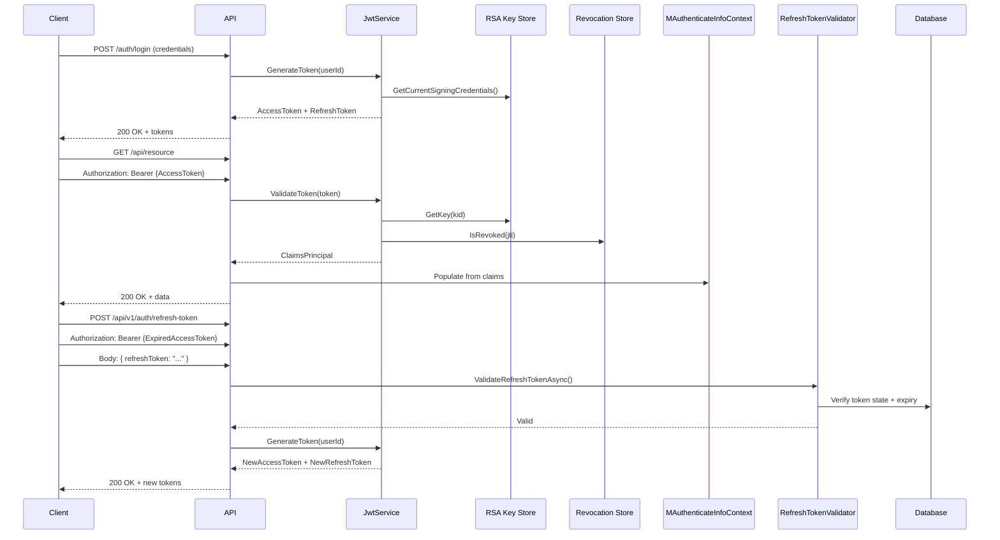

# Token Guide

JWT (JSON Web Token) tokens form the backbone of stateless API authentication in Muonroi. This guide explains token lifecycle, configuration, generation, validation, and refresh flows.

## Overview

JWT tokens consist of a signed header, payload, and signature. The Muonroi ecosystem uses **RS256 (RSA-SHA256)** by default for signing, allowing token verification without the private key. The system tracks active tokens in a revocation store and enforces refresh token rotation to maintain security.

## Architecture



## Configuration

Token behavior is controlled via the `TokenConfigs` section in **appsettings.json**:

```json
{
  "TokenConfigs": {
    "SymmetricSecretKey": "your-secret-key-min-32-chars",
    "Issuer": "https://myapi.example.com",
    "Audience": "myapi-client",
    "ExpiryMinutes": 15,
    "RefreshTokenTtl": 10080,
    "RefreshTokenEim": 10440,
    "UseRsa": true,
    "PublicKeyPath": "keys/rsa_public.pem",
    "PrivateKeyPath": "keys/rsa_private.pem",
    "MultiTenantEnabled": false,
    "EnableCookieAuth": false,
    "CookieName": "AuthToken",
    "CookieSameSite": "Lax"
  }
}
```

### Configuration Fields

| Field | Type | Purpose | Default |
|-------|------|---------|---------|
| `SymmetricSecretKey` | string | Fallback HMAC key (if UseRsa=false) | Required |
| `Issuer` | string | Token issuer claim (iss) | Required |
| `Audience` | string | Token audience claim (aud) | Required |
| `ExpiryMinutes` | int | Access token lifetime in minutes | 15 |
| `RefreshTokenTtl` | int | Refresh token TTL in minutes | 10080 (7 days) |
| `RefreshTokenEim` | int | Extended inactivity margin in minutes | 10440 |
| `UseRsa` | bool | Use RSA-2048 signing instead of HMAC | true |
| `PublicKeyPath` | string | Path to RSA public key PEM file | null |
| `PrivateKeyPath` | string | Path to RSA private key PEM file | null |
| `MultiTenantEnabled` | bool | Support per-tenant signing keys | false |
| `SigningKeysByTenant` | dict | Tenant-specific signing keys | {} |
| `EnableCookieAuth` | bool | Store token in HTTP-only cookie | false |
| `CookieName` | string | Cookie name for auth token | "AuthToken" |
| `CookieSameSite` | string | Cookie SameSite policy | "Lax" |

### Inline vs. File-Based Keys

If `PublicKeyPath` is set, it takes priority over inline `PublicKey`. Same applies for `PrivateKeyPath` vs. `PrivateKey`. The helper methods resolve keys at runtime:

```csharp
MTokenInfo tokenInfo = new() { ... };
string effectivePrivateKey = tokenInfo.GetEffectivePrivateKey();
string effectivePublicKey = tokenInfo.GetEffectivePublicKey();
```

## Service Registration

Register JWT services in your startup:

```csharp
public void ConfigureServices(IServiceCollection services, IConfiguration configuration)
{
    // RSA key store (in-memory or Redis)
    services.AddInMemoryRsaKeyStore();
    // OR distributed:
    // services.AddRedisRsaKeyStore(configuration);

    // Bind token config and register JWT service
    services.AddValidateBearerToken<MyDbContext, MTokenInfo, MyPermission>(configuration);

    // Token revocation + state validation
    services.AddAuthTokenValidation<MyDbContext, MyPermission>();

    // Permission-based authorization
    services.AddPermissionFilter<MyPermission>();
}
```

### Key Registration Methods

- **`AddInMemoryRsaKeyStore()`** — Stores RSA keys in-memory. Useful for single-instance deployments. Keys are lost on restart.
- **`AddRedisRsaKeyStore(configuration)`** — Stores RSA keys in Redis for distributed scenarios. Keys persist across restarts.

Both methods register:
- `IRsaKeyStore` — RSA key management
- `ITokenRevocationStore` — JWT revocation tracking
- `JwtService` — Token generation and validation

## Token Models

### MTokenInfo

Holds JWT configuration. Used by `JwtService`:

```csharp
public class MTokenInfo
{
    public string SymmetricSecretKey { get; set; }
    public string Issuer { get; set; }
    public string Audience { get; set; }
    public int ExpiryMinutes { get; set; }
    public int RefreshTokenTtl { get; set; }
    public int RefreshTokenEim { get; set; }
    public bool UseRsa { get; set; }
    public string PublicKey { get; set; }
    public string PrivateKey { get; set; }
    public string? PublicKeyPath { get; set; }
    public string? PrivateKeyPath { get; set; }
    public bool MultiTenantEnabled { get; set; }
    public Dictionary<string, string> SigningKeysByTenant { get; set; }
    public bool EnableCookieAuth { get; set; }
    public string CookieName { get; set; }
    public string CookieSameSite { get; set; }

    public string GetEffectivePrivateKey() { ... }
    public string GetEffectivePublicKey() { ... }
}
```

### MAuthenticateInfoContext

Populated after token validation. Contains the authenticated user's claims and permissions:

```csharp
public interface IAuthenticateInfoContext : ICurrentUserContext
{
    string CorrelationId { get; set; }
    string CurrentUserGuid { get; set; }
    string CurrentUsername { get; set; }
    string? TenantId { get; set; }
    string TokenValidityKey { get; set; }
    string? AccessToken { get; set; }
    string? ApiKey { get; set; }
    string? Permission { get; set; }
    string Language { get; set; }
    bool IsAuthenticated { get; set; }

    string GetAccessToken();
}
```

Inject into your service to access authenticated user info:

```csharp
public class MyService(IAuthenticateInfoContext context)
{
    public void DoWork()
    {
        string userId = context.CurrentUserGuid;
        string? tenant = context.TenantId;
        bool isAuth = context.IsAuthenticated;
    }
}
```

### MRefreshToken

Stored in database to track refresh token state:

```csharp
public class MRefreshToken : MEntity
{
    public string Token { get; set; }
    public string TokenValidityKey { get; set; }
    public DateTime? ExpiredDate { get; set; }
    public DateTime? RevokedDate { get; set; }
    public DateTime LastUsedDate { get; set; }
    public string ReasonRevoked { get; set; }
    public bool IsRevoked { get; set; }
}
```

### RefreshTokenResponseModel

Returned by the refresh endpoint:

```csharp
public class RefreshTokenResponseModel
{
    public string AccessToken { get; set; }
    public string RefreshToken { get; set; }
}
```

## Token Lifecycle

### 1. Token Generation

Use `JwtService.GenerateToken()` to issue a new token:

```csharp
public class AuthController(JwtService jwtService, IMDateTimeService dateTime)
{
    [HttpPost("login")]
    public IActionResult Login([FromBody] LoginRequest request)
    {
        // Verify credentials (pseudocode)
        if (!VerifyPassword(request.Username, request.Password, out var userId))
            return Unauthorized();

        // Generate access token (15 minute lifetime)
        string accessToken = jwtService.GenerateToken(
            subject: userId,
            lifetime: TimeSpan.FromMinutes(15)
        );

        // Generate refresh token (7 days lifetime)
        string refreshToken = jwtService.GenerateToken(
            subject: userId,
            lifetime: TimeSpan.FromDays(7)
        );

        // Save refresh token to database with validation key
        var tokenRecord = new MRefreshToken
        {
            Token = refreshToken,
            TokenValidityKey = Guid.NewGuid().ToString(),
            ExpiredDate = dateTime.UtcNow().AddDays(7),
            LastUsedDate = dateTime.UtcNow()
        };
        _dbContext.Set<MRefreshToken>().Add(tokenRecord);
        _dbContext.SaveChanges();

        return Ok(new { accessToken, refreshToken });
    }
}
```

### 2. Token Validation

The middleware automatically validates bearer tokens in the `Authorization` header:

```csharp
app.UseRouting();
app.UseAuthentication();  // Validates JWT
app.UseAuthorization();   // Checks permissions
```

`JwtService.ValidateToken()` performs:
1. **Signature verification** — Check RS256 signature with public key
2. **Issuer & audience validation** — Verify iss and aud claims
3. **Lifetime validation** — Check exp and nbf claims
4. **Revocation check** — Query revocation store for jti (JWT ID)

If any check fails, a `SecurityTokenException` is thrown and the request is rejected (401 Unauthorized).

### 3. Token Refresh

When the access token expires, use the refresh endpoint to get a new pair:

```csharp
[HttpPost("refresh-token")]
[AllowAnonymous]  // Refresh endpoint is public
public async Task<IActionResult> RefreshToken(
    [FromBody] RefreshTokenRequestModel request,
    [FromServices] IRefreshTokenValidator validator)
{
    // Validate refresh token state in database
    var isValid = await validator.ValidateRefreshTokenAsync(
        refreshToken: request.RefreshToken,
        currentUserId: User.FindFirst(ClaimTypes.NameIdentifier)?.Value
    );

    if (!isValid)
        return Unauthorized("Invalid or expired refresh token");

    // Extract claims from expired access token (still readable)
    var principal = jwtService.ValidateToken(request.AccessToken);
    var userId = principal.FindFirst(ClaimTypes.NameIdentifier)?.Value;

    // Issue new token pair
    var newAccessToken = jwtService.GenerateToken(userId, TimeSpan.FromMinutes(15));
    var newRefreshToken = jwtService.GenerateToken(userId, TimeSpan.FromDays(7));

    return Ok(new RefreshTokenResponseModel
    {
        AccessToken = newAccessToken,
        RefreshToken = newRefreshToken
    });
}
```

### 4. Token Revocation

Revoke a token immediately (e.g., on logout):

```csharp
[HttpPost("logout")]
public IActionResult Logout()
{
    var token = Request.Headers["Authorization"].ToString().Replace("Bearer ", "");
    jwtService.RevokeToken(token);
    return Ok();
}
```

The token's JTI is added to the revocation store. Future validation attempts will reject it, even if the signature is valid.

## Pipeline Setup

Ensure correct middleware order:

```csharp
public void Configure(IApplicationBuilder app, IWebHostEnvironment env)
{
    app.UseRouting();

    // Authentication middleware (validates JWT and populates HttpContext.User)
    app.UseAuthentication();

    // Authorization middleware (checks permissions)
    app.UseAuthorization();

    app.UseEndpoints(endpoints => endpoints.MapControllers());
}
```

**Order matters:**
1. **Routing** first — so route data is available to middleware
2. **Authentication** — validates tokens and populates claims
3. **Authorization** — checks permissions on populated claims

## Key Rotation

RSA keys should be rotated periodically for security:

```csharp
[HttpPost("admin/rotate-keys")]
[Authorize(Roles = "Admin")]
public IActionResult RotateKeys([FromServices] JwtService jwtService)
{
    jwtService.RotateKeys();
    return Ok("Keys rotated successfully");
}
```

All previously signed tokens remain valid (verified with old public key). Only new tokens are signed with the new private key.

## JWKS Endpoint

Provide a public endpoint for clients to fetch your public keys:

```csharp
[HttpGet(".well-known/jwks.json")]
[AllowAnonymous]
public IActionResult GetJwks([FromServices] JwtService jwtService)
{
    var jwks = jwtService.GetJsonWebKeySet();
    return Ok(jwks);
}
```

External services can fetch your public keys from this endpoint and validate your tokens without contacting your API.

## Cross-References

- **Auth Module Guide** — Overall authentication strategy and recommended setup
- **Permission Guide** — Role and permission enforcement
- **BFF Guide** — Session-based auth with cookies instead of tokens
- **Policy Decision Guide** — Centralized authorization with external policy engines

## Common Patterns

### Extract Claims

```csharp
public class MyService(IAuthenticateInfoContext context)
{
    public string GetUserId() => context.CurrentUserGuid;
    public string GetTenant() => context.TenantId ?? "default";
    public bool IsAdmin() => context.Permission?.Contains("Admin") ?? false;
}
```

### Validate Expiry Before Refresh

```csharp
public bool ShouldRefresh(string token)
{
    var principal = jwtService.ValidateToken(token);
    var exp = principal.FindFirst("exp")?.Value;

    return long.TryParse(exp, out var expiryUnix)
        && DateTimeOffset.FromUnixTimeSeconds(expiryUnix) < DateTime.UtcNow.AddMinutes(5);
}
```

### Multi-Tenant Keys

If `MultiTenantEnabled: true`, specify per-tenant signing keys:

```json
{
  "TokenConfigs": {
    "MultiTenantEnabled": true,
    "SigningKeysByTenant": {
      "tenant-1": "secret-for-tenant-1",
      "tenant-2": "secret-for-tenant-2"
    }
  }
}
```

The JWT service uses the `tenantId` claim to select the correct key for signing and validation.
