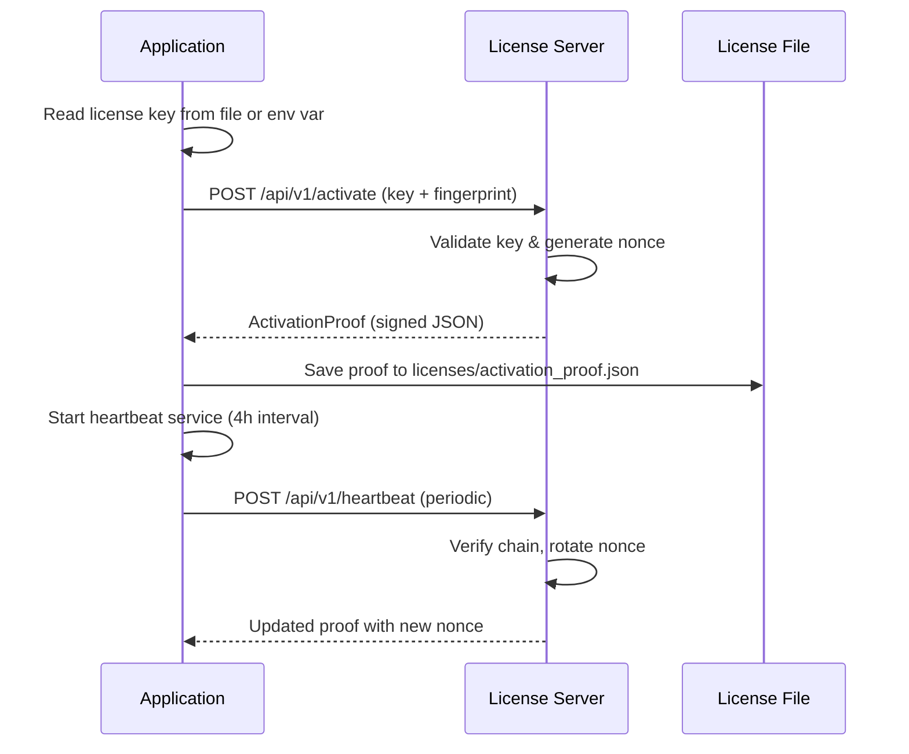
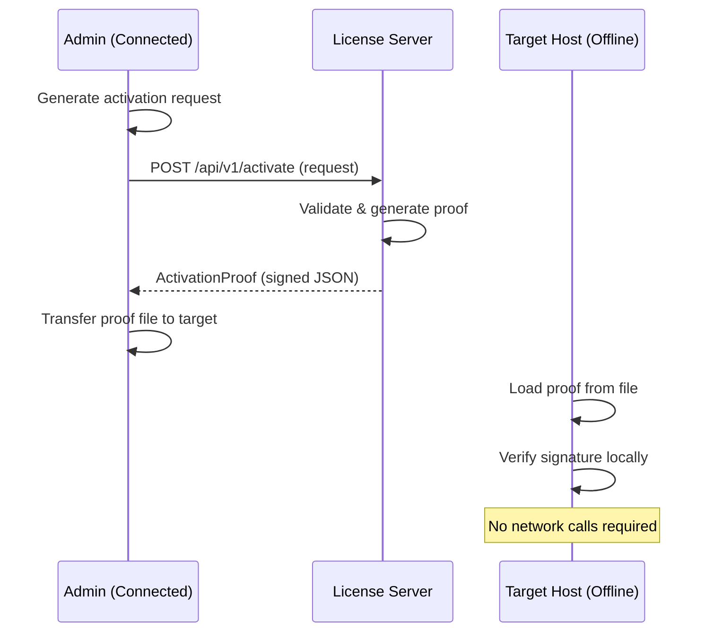

# License Activation

The Muonroi License Server issues keys in the `MRR-...` format and manages the activation lifecycle. This guide covers both **Online Mode** (default, internet-connected) and **Offline Mode** (air-gapped environments).

## Overview

License activation converts a license key into a signed **ActivationProof** containing tier, features, expiry, and heartbeat nonce. The proof can be verified locally without contacting the license server on every request.

**Key Points:**
- License keys: `MRR-{base64url}` format
- Signed by server (RSA-2048)
- Grace period: 24 hours (revocation)
- Heartbeat: every 4 hours (configurable)
- Fallback tier: Free (on expiry)

---

## License Server Endpoints

| Endpoint | Method | Auth | Description |
|----------|--------|------|-------------|
| `/api/v1/activate` | POST | Public | Activate license with machine fingerprint |
| `/api/v1/heartbeat` | POST | Public | Periodic heartbeat (nonce rotation) |
| `/api/v1/validate` | POST | Public | Validate current license status |
| `/api/v1/keys/generate` | POST | Admin | Generate new license key |
| `/api/v1/keys/{key}` | GET | Admin | Retrieve license record |
| `/api/v1/keys/revoke` | POST | Admin | Revoke an existing key |
| `/health` | GET | Public | Health check |

**Base URL:** `https://license.truyentm.xyz`

---

## Online Mode (Default)

Online mode connects to the license server during activation and runs periodic heartbeats. Recommended for most deployments.

### Activation Flow



### Step 1: Configure Online Mode

**appsettings.json:**

```json
{
  "LicenseConfigs": {
    "Mode": "Online",
    "LicenseFilePath": "licenses/license.key",
    "ActivationProofPath": "licenses/activation_proof.json",
    "FallbackToOnlineActivation": true,
    "Online": {
      "Endpoint": "https://license.truyentm.xyz",
      "EnableHeartbeat": true,
      "HeartbeatIntervalMinutes": 240,
      "RevocationGraceHours": 24,
      "TimeoutSeconds": 10
    }
  }
}
```

| Config Key | Type | Default | Description |
|------------|------|---------|-------------|
| `Mode` | string | `Online` | `Online` or `Offline` |
| `LicenseFilePath` | string | `licenses/license.key` | Path to license key file |
| `ActivationProofPath` | string | `licenses/activation_proof.json` | Path to store proof |
| `FallbackToOnlineActivation` | bool | `true` | Retry online if offline fails |
| `Online.Endpoint` | string | `https://license.truyentm.xyz` | License server URL |
| `Online.EnableHeartbeat` | bool | `true` | Enable periodic heartbeat |
| `Online.HeartbeatIntervalMinutes` | int | `240` | Heartbeat interval (4h) |
| `Online.RevocationGraceHours` | int | `24` | Grace period after revocation |
| `Online.TimeoutSeconds` | int | `10` | HTTP request timeout |

### Step 2: Create License File

**licenses/license.key:**

```json
{
  "LicenseKey": "MRR-YWJjZGVmZ2hpamtsbW5vcA=="
}
```

Or set via environment variable:

```bash
export MUONROI_LICENSE_KEY="MRR-YWJjZGVmZ2hpamtsbW5vcA=="
```

### Step 3: Automatic Activation

On startup, `LicenseActivator` will:

1. Read license key from file or env var
2. POST to `/api/v1/activate` with machine fingerprint
3. Receive signed `ActivationProof`
4. Save proof to `licenses/activation_proof.json`
5. Start `HeartbeatBackgroundService` (runs every 4h)

**Example Activation Request:**

```bash
curl -X POST https://license.truyentm.xyz/api/v1/activate \
  -H "Content-Type: application/json" \
  -d '{
    "licenseKey": "MRR-YWJjZGVmZ2hpamtsbW5vcA==",
    "machineFingerprint": "abc123def456ghi789"
  }'
```

**Example Response:**

```json
{
  "tier": "Enterprise",
  "features": [
    "rule-engine",
    "multi-tenant",
    "advanced-auth",
    "audit-trail"
  ],
  "expiresAt": "2025-12-31T23:59:59Z",
  "activatedAt": "2024-12-20T10:30:00Z",
  "heartbeatNonce": "nonce-uuid-v4-here",
  "signedPayload": "eyJhbGciOiJSUzI1NiIsInR5cCI6IkpXVCJ9...",
  "activationProof": {
    "licenseKey": "MRR-...",
    "tier": "Enterprise",
    "features": [...],
    "expiresAt": "2025-12-31T23:59:59Z",
    "signature": "base64-hmac-signature"
  }
}
```

### Step 4: Heartbeat Lifecycle

The heartbeat service runs automatically in the background:

**Example Heartbeat Request:**

```bash
curl -X POST https://license.truyentm.xyz/api/v1/heartbeat \
  -H "Content-Type: application/json" \
  -d '{
    "licenseKey": "MRR-YWJjZGVmZ2hpamtsbW5vcA==",
    "currentNonce": "nonce-uuid-v4-from-proof",
    "machineFingerprint": "abc123def456ghi789"
  }'
```

**Heartbeat Behavior:**
- Runs every 4 hours (configurable via `HeartbeatIntervalMinutes`)
- Nonce rotates on each successful heartbeat
- Grace period: 24 hours after revocation (downgrades to Free tier)
- Failure handling: log warning, try again at next interval
- Network timeout: 10 seconds (configurable)

---

## Offline Mode

Offline mode is for air-gapped or restricted-internet environments. The activation proof is generated on an internet-connected machine and transferred to the target host.

### Activation Flow



### Step 1: Configure Offline Mode

**appsettings.json:**

```json
{
  "LicenseConfigs": {
    "Mode": "Offline",
    "LicenseFilePath": "licenses/license.key",
    "ActivationProofPath": "licenses/activation_proof.json",
    "FallbackToOnlineActivation": false,
    "Offline": {
      "PublicKeyPath": "licenses/license_server_public.pem"
    }
  }
}
```

### Step 2: Generate Activation on Connected Machine

On a machine with internet access:

```bash
curl -X POST https://license.truyentm.xyz/api/v1/activate \
  -H "Content-Type: application/json" \
  -d '{
    "licenseKey": "MRR-YWJjZGVmZ2hpamtsbW5vcA==",
    "machineFingerprint": "target-host-fingerprint",
    "offline": true
  }' > activation_proof.json
```

Save the response to `activation_proof.json`.

### Step 3: Transfer Proof to Target Host

Transfer `activation_proof.json` to the target host:

```bash
scp activation_proof.json user@target-host:/app/licenses/
```

### Step 4: Load Proof on Target Host

The runtime loads the proof from disk on startup:

1. Read license key from `LicenseFilePath`
2. Read proof from `ActivationProofPath`
3. Verify signature using public key from `PublicKeyPath`
4. Validate tier and features
5. No network calls made

**No heartbeat service runs in Offline mode.**

---

## HMAC Chain Verification

Each heartbeat updates the HMAC chain to prevent tampering and detect revocation.

### Chain Structure

```
HMAC Key:
  SHA256(licenseSignature + projectSeed + salt + serverNonce)

HMAC Data:
  {previous}|{sequence}|{tenantId}|{action}|{hash}|{timestamp}

Verification:
  HMAC_SHA256(key, data) == received_signature
```

### Example Chain Link

```json
{
  "sequence": 1,
  "tenantId": "tenant-123",
  "action": "heartbeat",
  "hash": "abc123def456",
  "timestamp": "2024-12-20T10:30:00Z",
  "signature": "hmac-sha256-signature",
  "previousSignature": "previous-link-signature"
}
```

**Verification happens automatically:**
- On each heartbeat
- Before granting access to rule-engine features
- Fail-closed: denies access if chain is broken

---

## Program.cs Registration

Register license services in your application startup:

```csharp
using Muonroi.Governance.Enterprise;

var services = new ServiceCollection();

// Register license protection (all modes)
services.AddLicenseProtection(configuration);

// Register anti-tamper detection (Enterprise only)
services.AddMEnterpriseGovernance(configuration);

// Register ILicenseGuard for feature checks
services.AddScoped<ILicenseGuard>(sp =>
    sp.GetRequiredService<LicenseGuard>());
```

### Runtime Feature Checks

```csharp
public class MyRuleService(ILicenseGuard guard)
{
    public async Task ExecuteRuleAsync(string ruleName)
    {
        // Throws if feature not allowed
        guard.EnsureValid("rule-engine");

        // Check tier
        if (guard.Tier != LicenseTier.Enterprise)
            throw new UnauthorizedAccessException("Enterprise required");

        // Check specific feature
        bool hasMultiTenant = guard.HasFeature("multi-tenant");

        // Proceed with execution
        await ExecuteAsync(ruleName);
    }
}
```

---

## Error Handling

| Status | Scenario | Handling |
|--------|----------|----------|
| 200 | Success | Store proof, continue |
| 400 | Invalid key | Check key format, retry with correct key |
| 401 | Unauthorized | Check admin credentials |
| 403 | Revoked key | Use fallback tier (Free) for grace period |
| 404 | Key not found | Generate new key via admin API |
| 500 | Server error | Retry with `FallbackToOnlineActivation=true` |
| Timeout | Network timeout | Retry at next heartbeat interval |

---

## Monitoring

Check license status programmatically:

```bash
curl -X POST https://license.truyentm.xyz/api/v1/validate \
  -H "Content-Type: application/json" \
  -d '{
    "licenseKey": "MRR-YWJjZGVmZ2hpamtsbW5vcA=="
  }'
```

**Response:**

```json
{
  "isValid": true,
  "tier": "Enterprise",
  "expiresAt": "2025-12-31T23:59:59Z",
  "heartbeatNonce": "nonce-uuid-v4-here",
  "gracePeriodRemaining": "24h",
  "features": [...]
}
```

---

## See Also

- [License Capability Model](license-capability-model.md) — Feature matrix by tier
- [Tier Enforcement](tier-enforcement.md) — Runtime feature guards
- [License Server Admin](../license-server/admin-api.md) — Generate and revoke keys
