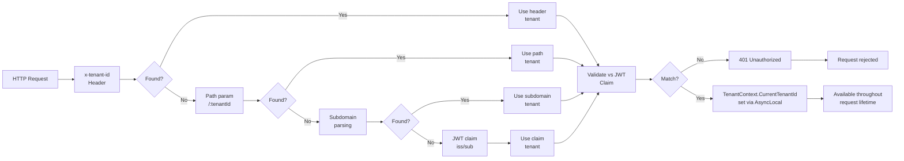

# Multi-Tenant Guide

This guide covers the canonical tenant context access pattern, resolution flow, and data isolation strategies in the Muonroi ecosystem.

:::tip Template quick-start
All three Muonroi project templates ship with multi-tenancy **disabled by default** (`MultiTenantConfigs:Enabled = false` in `appsettings.json`). To activate it:

1. Set `MultiTenantConfigs:Enabled = true` in your `appsettings.json`.
2. The middleware is already wired in `StartupExtensions.cs` — no code changes needed; `UseMiddleware<TenantResolutionMiddleware>()` is called automatically when the flag is `true`.
3. Register tenant services by ensuring `services.AddTenancy(configuration)` is present in `RegisterService.cs` (it is included by default in all templates).

**Microservices template**: the Gateway service is responsible for reading the `X-Tenant-Id` header from the client and forwarding it to downstream services. Individual microservices trust the forwarded header.

**Modular template**: tenant is resolved from the incoming request (header → path → subdomain → JWT claim) in the Host project before any module DI resolves tenant-scoped services.
:::

## Quick Start

Use `ISystemExecutionContextAccessor` to access tenant context anywhere in your code:

```csharp
private readonly ISystemExecutionContextAccessor _contextAccessor;

ISystemExecutionContext context = _contextAccessor.Get();
string? tenantId = context.TenantId;
Guid? userId = Guid.TryParse(context.UserId, out Guid parsed) ? parsed : null;
```

No parameter passing is required — tenant context is propagated via `AsyncLocal<T>` and available throughout the request.

## Tenant Resolution Flow

The tenant is resolved in this order:



### Resolution Rules

1. **x-tenant-id Header** (highest priority)
   Check incoming request header `x-tenant-id`.

2. **Path Parameter**
   If header missing, extract `{tenantId}` from route (e.g., `/api/tenants/{tenantId}/rules`).

3. **Subdomain**
   If no header/path param, parse subdomain (e.g., `tenant-1.myapp.com`).

4. **JWT Claim** (fallback)
   If all above fail, use `iss` or `sub` claim from JWT token.

5. **Validation**
   Resolved tenant **must match** the JWT claim value.
   **Mismatch returns 401 Unauthorized** — fail-closed security model.

## AsyncLocal Context Propagation

Once resolved, tenant context is stored in `AsyncLocal<TenantContext>` by `TenantResolutionMiddleware`:

```csharp
// Set once at request entry
TenantContext.CurrentTenantId = resolvedTenantId;

// Available everywhere inside the request
public class MyService
{
    public void DoWork()
    {
        var tenantId = TenantContext.CurrentTenantId;  // No parameter needed
        // Use tenantId in business logic
    }
}
```

**Key Benefits:**
- No method parameter pollution
- Works across synchronous and async call chains
- Automatically cleaned up at request end

## Transport Boundaries

Tenant context is automatically initialized at these boundaries:

- `JwtMiddleware` — HTTP/REST requests
- `GrpcServerInterceptor` — gRPC calls
- `AmqpContextConsumeFilter` — message queue consumers
- `TenantContextConsumeFilter` — event bus consumers
- `JobContextActivatorFilter` — scheduled job execution
- `QuartzContextJobListener` — Quartz job scheduling

No additional setup is required at these boundaries.

## Temporary Context Switching with ContextMirrorScope

When you need to **temporarily switch tenant context** (e.g., cross-tenant admin operations), use `ContextMirrorScope`:

```csharp
private readonly ISystemExecutionContextAccessor _contextAccessor;
private readonly ILogScopeFactory _logScopeFactory;

public async Task AdminOperationAsync(string targetTenantId)
{
    // Save current context
    var originalContext = _contextAccessor.Get();

    // Switch to target tenant (push)
    var targetContext = new SystemExecutionContext
    {
        TenantId = targetTenantId,
        UserId = originalContext.UserId  // Admin user ID
    };

    using var scope = new SystemExecutionContextScope(_contextAccessor, targetContext);
    using var mirror = ContextMirrorScope.Apply(targetContext, _logScopeFactory);
    {
        // All code here executes as targetTenantId
        var data = await _repository.GetAsync();  // Uses targetTenantId filters

    } // Pop: context restored to originalContext
}
```

**Lifecycle:**
1. **Push** — Create scope with new context
2. **Execute** — All nested code sees new tenant ID
3. **Pop** — Automatic cleanup restores original context

## Data Isolation Strategies

Muonroi supports **3 tenant isolation models** (select at deployment time):

| Strategy | Isolation Level | Use Case |
|----------|-----------------|----------|
| **Shared Database, Filtered Schema** | Medium | Multi-tenant SaaS, trusted infrastructure |
| **Separate Database Schema** | High | Compliance (SOC2), GDPR zones |
| **Database Per Tenant** | Maximum | Regulatory isolation, data residency |

All strategies enforce isolation via **EF Core query filters** (see [Tenant Isolation Strategies](tenant-isolation.md)).

## Entity Framework Query Filters

All entities implementing `ITenantScoped` automatically receive a query filter:

```csharp
// Applied automatically by DbContext configuration
e => e.TenantId == TenantContext.CurrentTenantId ||
     TenantContext.CurrentTenantId == null
```

**This filter is transparent** — your LINQ queries never need to manually filter by tenant:

```csharp
// Before (manual filter — don't do this)
var rules = await _db.Rules
    .Where(r => r.TenantId == tenantId)
    .ToListAsync();

// After (automatic filter — preferred)
var rules = await _db.Rules
    .ToListAsync();  // Automatically filtered by CurrentTenantId
```

See [EF Core Filters Guide](../../02-concepts/ef-filters.md) for details.

## Quota System

Each tenant has per-feature quotas enforced at runtime:

- **13 quota types** (workflows, rules, concurrent executions, API calls, etc.)
- **4 tier presets** (Free, Starter, Professional, Enterprise)
- **Per-period tracking** (daily, monthly, annual)

Example:

```csharp
public class RuleExecutionService
{
    private readonly IQuotaService _quotaService;

    public async Task<Result> ExecuteRuleAsync(string tenantId, string ruleId)
    {
        // Check quota before execution
        var allowed = await _quotaService.CheckAndConsumeAsync(
            tenantId,
            QuotaType.RuleExecutions,
            amount: 1
        );

        if (!allowed)
            return Result.Failure("Quota exceeded");

        // Execute rule...
    }
}
```

For detailed quota configuration and enforcement, see [Multi-Tenant Quota Guide](multi-tenant-quota-guide.md).

## Legacy Mirror Support

When downstream packages still depend on `TenantContext` or `UserContext`, use `ContextMirrorScope`:

```csharp
using var scope = new SystemExecutionContextScope(_contextAccessor,
    new SystemExecutionContext(tenantId, userId));

using var mirror = ContextMirrorScope.Apply(scope.Context, _logScopeFactory);
{
    // Legacy code sees TenantContext.CurrentTenantId populated
    var legacyData = LegacyService.GetData();
}
```

This is a **migration path only** — new code should use `ISystemExecutionContextAccessor` directly.

## Current Quota Endpoints

Control Plane APIs for tenant quota management:

- `GET /api/v1/tenants/{tenantId}/quotas` — fetch current quotas
- `PUT /api/v1/tenants/{tenantId}/quotas` — update quota tiers
- `GET /api/v1/control-plane/quotas/{tenantId}` — detailed quota usage

## Common Patterns

### Access Current Tenant in a Service

```csharp
public class RuleService(ISystemExecutionContextAccessor contextAccessor)
{
    public async Task<List<Rule>> GetRulesAsync()
    {
        var tenantId = contextAccessor.Get().TenantId;
        return await _db.Rules.ToListAsync();  // Auto-filtered
    }
}
```

### Validate Tenant Access Before Operation

```csharp
public async Task DeleteTenantDataAsync(string requestedTenantId)
{
    var currentTenantId = _contextAccessor.Get().TenantId;

    if (requestedTenantId != currentTenantId)
        throw new UnauthorizedAccessException("Tenant mismatch");

    // Safe to delete
}
```

### Admin: Execute in Different Tenant Context

```csharp
public async Task AdminResetQuotaAsync(string targetTenantId)
{
    var adminContext = _contextAccessor.Get();

    using var scope = new SystemExecutionContextScope(
        _contextAccessor,
        new SystemExecutionContext { TenantId = targetTenantId }
    );
    using var mirror = ContextMirrorScope.Apply(scope.Context, _logScopeFactory);
    {
        // Execute as targetTenantId
        await _quotaService.ResetAsync(targetTenantId);
    }
}
```

## Related Guides

- [Tenant Isolation Strategies](tenant-isolation.md) — Deployment isolation models (SharedSchema, SeparateSchema, SeparateDatabase)
- [EF Core Query Filters](../../02-concepts/ef-filters.md) — Automatic tenant filtering in Entity Framework
- [Multi-Tenant Quota Guide](multi-tenant-quota-guide.md) — Quota enforcement, tier presets, consumption tracking
- [Authentication & Authorization](../identity-access/auth-module-guide.md) — JWT resolution and claim validation
