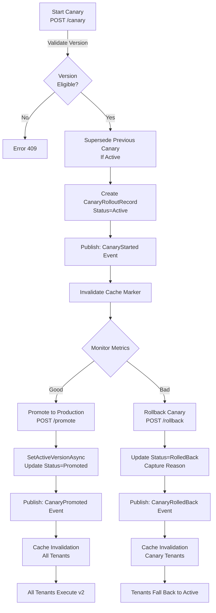

# Rule Rollout Guide

Current rollout strategy combines approval, activation, canary deployments, and live notifications to enable safe, controlled deployment of rule changes to production.

## Overview

The rollout pipeline ensures rule changes are validated, approved, and deployed safely:

1. **Save** a new version (Draft)
2. **Submit** for approval (PendingApproval)
3. **Approve** with a different actor (Approved)
4. **Route traffic** via canary or activate directly (Active)
5. **Monitor** and promote or rollback (Promoted / RolledBack)
6. **Broadcast** state changes to all listeners (SignalR, Redis pub/sub)

## Required Configuration

Enable the full rollout pipeline:

```json
{
  "RuleControlPlane": {
    "RequireApproval": true,
    "NotifyOnStateChange": true,
    "EnableCanary": true
  }
}
```

| Setting | Type | Default | Purpose |
|---------|------|---------|---------|
| `RequireApproval` | bool | true | Require approval before activation |
| `NotifyOnStateChange` | bool | true | Publish state changes to subscribers |
| `EnableCanary` | bool | true | Allow canary deployments |

## Operational Rules

- **Approval enforcement**: Do not skip the approval state when `RequireApproval=true`. The PostgreSQL rule store blocks activation of Draft or Rejected versions in that mode.
- **Canary prerequisite**: Only Approved, Active, or Superseded versions can be used for canary rollouts.
- **Single active canary**: Starting a new canary automatically supersedes the previous active canary for the same workflow.

---

# Canary Rollout Strategy

Canary deployments reduce risk by rolling out rule changes to a subset of tenants or traffic percentage before full activation.

## How Canary Works

Canary routing intercepts requests at the **RulesEngineService** cache layer:

```
Client Request
    ↓
RulesEngineService.ExecuteAsync(workflowName, tenantId)
    ↓
GetCanaryVersionForTenantAsync(workflowName, tenantId)
    ↓ (canary active?)
    ├→ Yes: Return canary version (skip caching)
    ├→ No: Return active version (from cache)
    ↓
RuleOrchestrator (execute + telemetry)
```

**Targeting strategies**:

- **Percentage-based**: Route X% of traffic to new version (SHA256 hash of tenant ID determines bucket)
- **Tenant-targeted**: Specific tenant IDs get new version (whitelist)
- **Combined**: Percentage + explicit tenants (tenants checked first)

## Canary Configuration

Two methods to start a canary:

### 1. Percentage-Based Canary

Route 20% of tenant traffic to v2:

```bash
curl -X POST https://cp.truyentm.xyz/api/v1/rulesets/order-fulfillment/canary \
  -H "X-Tenant-Id: acme-corp" \
  -H "Content-Type: application/json" \
  -d '{
    "version": 2,
    "targetPercentage": 20,
    "actor": "deployment-bot"
  }'
```

Response:

```json
{
  "id": "a1b2c3d4-e5f6-47a8-9b1c-2d3e4f5a6b7c",
  "tenantId": "acme-corp",
  "workflowName": "order-fulfillment",
  "version": 2,
  "targetTenantIds": [],
  "targetPercentage": 20,
  "status": "Active",
  "startedAt": "2026-03-20T10:30:00Z",
  "completedAt": null,
  "startedBy": "deployment-bot",
  "promotedBy": null,
  "rolledBackBy": null,
  "rollbackReason": null
}
```

**How percentage works**: The system hashes each tenant ID with SHA256, takes the first byte modulo 100, and checks if it's below the percentage threshold. This provides **deterministic**, **tenant-consistent** routing (same tenant always gets the same version).

### 2. Tenant-Targeted Canary

Route specific tenants to v2:

```bash
curl -X POST https://cp.truyentm.xyz/api/v1/rulesets/order-fulfillment/canary \
  -H "X-Tenant-Id: acme-corp" \
  -H "Content-Type: application/json" \
  -d '{
    "version": 2,
    "targetTenantIds": ["tenant-qa-1", "tenant-qa-2"],
    "actor": "deployment-bot"
  }'
```

### 3. Combined: Percentage + Tenants

Tenants are checked first; if matched, they always get the canary version:

```bash
curl -X POST https://cp.truyentm.xyz/api/v1/rulesets/order-fulfillment/canary \
  -H "X-Tenant-Id: acme-corp" \
  -H "Content-Type: application/json" \
  -d '{
    "version": 2,
    "targetTenantIds": ["tenant-qa-1"],
    "targetPercentage": 10,
    "actor": "deployment-bot"
  }'
```

In this case:
- tenant-qa-1: **always** gets v2 (targeted)
- Other tenants: ~10% get v2 (percentage)

## Monitoring Canary

### List Active Canaries

```bash
curl -X GET "https://cp.truyentm.xyz/api/v1/canary?workflowName=order-fulfillment" \
  -H "X-Tenant-Id: acme-corp"
```

Response:

```json
[
  {
    "id": "a1b2c3d4-e5f6-47a8-9b1c-2d3e4f5a6b7c",
    "workflowName": "order-fulfillment",
    "version": 2,
    "targetPercentage": 20,
    "status": "Active",
    "startedAt": "2026-03-20T10:30:00Z",
    "startedBy": "deployment-bot"
  }
]
```

### Monitoring Metrics

Monitor these in your telemetry system:

- **Rule execution latency** by version (v1 vs v2)
- **Error rate** by version
- **Business metric changes** (e.g., fraud score, approval rate)
- **Tenant-level error patterns** in canary cohort

Compare against baseline (previous active version) during the canary window.

---

## Promotion to Production

Once canary metrics look good, promote to full rollout:

```bash
curl -X POST "https://cp.truyentm.xyz/api/v1/canary/a1b2c3d4-e5f6-47a8-9b1c-2d3e4f5a6b7c/promote" \
  -H "X-Tenant-Id: acme-corp" \
  -H "Content-Type: application/json" \
  -d '{
    "actor": "sre-team"
  }'
```

**Promotion workflow**:

1. Validate canary is Active (not already promoted/rolled back)
2. Call `SetActiveVersionAsync(workflowName, version)` — makes v2 the global active version
3. Update canary record: status = Promoted, completedAt = now
4. Publish `RuleSetChangeEvent(type: "canary_promoted")`
5. Cache invalidation triggers (see Hot-Reload Integration below)

Post-promotion, all tenants execute v2 (no more percentage routing).

---

## Rollback Procedure

If metrics degrade during canary, rollback immediately:

```bash
curl -X POST "https://cp.truyentm.xyz/api/v1/canary/a1b2c3d4-e5f6-47a8-9b1c-2d3e4f5a6b7c/rollback" \
  -H "X-Tenant-Id: acme-corp" \
  -H "Content-Type: application/json" \
  -d '{
    "reason": "Error rate increased from 0.5% to 3.2% in canary cohort",
    "actor": "sre-oncall"
  }'
```

**Rollback workflow**:

1. Validate canary is Active
2. Mark canary record: status = RolledBack, completedAt = now, rollbackReason = provided reason
3. Publish `RuleSetChangeEvent(type: "canary_rolled_back")`
4. Cache invalidation triggers — canary lookup returns null, requests fall back to active version
5. Audit entry captures: action=RollbackCanary, actor, reason, version

**Automatic rollback**: Starting a new canary for the same workflow automatically supersedes (rolls back) any previous active canary:

```csharp
// Previous canary auto-rolled back
foreach (var active in existingRollouts.Where(x => x.Status == CanaryStatus.Active))
{
    active.Status = CanaryStatus.RolledBack;
    active.RollbackReason = "Superseded by new canary rollout.";
}
```

---

# Service API Reference

## ICanaryRolloutService Interface

Located in `Muonroi.RuleEngine.Runtime.Rules`:

```csharp
public interface ICanaryRolloutService
{
    /// Start a canary rollout for a specific version
    Task<CanaryRolloutRecord> StartCanaryAsync(
        StartCanaryRequest request,
        CancellationToken cancellationToken = default);

    /// Promote active canary to global active version
    Task PromoteCanaryAsync(
        Guid rolloutId,
        string promotedBy,
        CancellationToken cancellationToken = default);

    /// Rollback active canary (stop routing to new version)
    Task RollbackCanaryAsync(
        Guid rolloutId,
        string rolledBackBy,
        string reason,
        CancellationToken cancellationToken = default);

    /// Check if canary is active for a specific tenant
    Task<bool> IsCanaryActiveForTenantAsync(
        string workflowName,
        string tenantId,
        CancellationToken cancellationToken = default);

    /// Get canary version for tenant (null if not targeted)
    Task<int?> GetCanaryVersionForTenantAsync(
        string workflowName,
        string tenantId,
        CancellationToken cancellationToken = default);
}
```

## Data Models

### CanaryRolloutRecord

```csharp
public sealed class CanaryRolloutRecord
{
    public Guid Id { get; set; }
    public string TenantId { get; set; }                    // Control plane tenant
    public string WorkflowName { get; set; }
    public int Version { get; set; }
    public string[] TargetTenantIds { get; set; }           // Whitelist
    public int? TargetPercentage { get; set; }              // 1-99
    public CanaryStatus Status { get; set; }                // Active|Promoted|RolledBack
    public DateTimeOffset StartedAt { get; set; }
    public DateTimeOffset? CompletedAt { get; set; }
    public string StartedBy { get; set; }
    public string? PromotedBy { get; set; }
    public string? RolledBackBy { get; set; }
    public string? RollbackReason { get; set; }
}
```

### CanaryStatus Enum

```csharp
public enum CanaryStatus
{
    Active = 0,      // Canary is running, traffic routed to new version
    Promoted = 1,    // Canary promoted to global active version
    RolledBack = 2   // Canary stopped, traffic routes to previous active version
}
```

### StartCanaryRequest

```csharp
public sealed class StartCanaryRequest
{
    public string WorkflowName { get; set; }
    public int Version { get; set; }
    public string[] TargetTenantIds { get; set; }     // Empty for percentage-only
    public int? TargetPercentage { get; set; }        // 1-99, optional
    public string StartedBy { get; set; }             // Actor (user/bot)
}
```

---

# REST API Endpoints

All endpoints require `X-Tenant-Id` header (control plane tenant).

| Method | Endpoint | Purpose |
|--------|----------|---------|
| POST | `/api/v1/rulesets/{workflow}/canary` | Start canary |
| GET | `/api/v1/canary` | List canaries (all or filtered) |
| POST | `/api/v1/canary/{rolloutId}/promote` | Promote to production |
| POST | `/api/v1/canary/{rolloutId}/rollback` | Rollback canary |

### POST `/api/v1/rulesets/{workflow}/canary`

Start a canary rollout.

**Request**:

```json
{
  "version": 2,
  "targetPercentage": 25,
  "targetTenantIds": ["qa-tenant-1"],
  "actor": "deployment-service"
}
```

**Parameters**:

- `version` (required, int > 0): Version to canary
- `targetPercentage` (optional, int 1-99): Percentage of traffic
- `targetTenantIds` (optional, string[]): Specific tenant IDs
- `actor` (optional, string): User or service starting canary

**Response**: `200 CanaryRolloutRecord`

**Errors**:

- `400`: Missing version or no targeting strategy
- `409`: Version not found or not eligible for canary

### GET /api/v1/canary

List canaries for the control plane tenant.

**Query parameters**:

- `workflowName` (optional): Filter by workflow name

**Response**: `200 CanaryRolloutRecord[]`

### POST `/api/v1/canary/{rolloutId}/promote`

Promote active canary to global active version.

**Request**:

```json
{
  "actor": "sre-team"
}
```

**Response**: `200 CanaryRolloutRecord` (updated record with status=Promoted)

### POST `/api/v1/canary/{rolloutId}/rollback`

Rollback active canary.

**Request**:

```json
{
  "reason": "Error rate spike detected",
  "actor": "on-call-sre"
}
```

**Parameters**:

- `reason` (required): Why canary is being rolled back
- `actor` (optional): User rolling back

**Response**: `200 CanaryRolloutRecord` (updated record with status=RolledBack)

---

# Hot-Reload Integration

Canary state changes integrate with the hot-reload system:

## Cache Invalidation Strategy

When canary state changes, the system invalidates 3 cache levels:

1. **Canary marker cache** (IMemoryCache): Invalidate lookup cache with new GUID
2. **RuntimeCache** (per-tenant TTL): Clears on TenantContext change
3. **WorkflowCache** (max 2048 static): Clears globally on version change

Code:

```csharp
private void InvalidateCanaryCache(string tenantId, string workflowName)
{
    // Create new marker GUID — invalidates all cache keys using old marker
    string markerKey = $"ruleset:canary:marker:{tenantId}:{workflowName}".ToLowerInvariant();
    memoryCache.Set(markerKey, Guid.NewGuid().ToString("N"), CanaryLookupCacheTtl);
}
```

Canary lookup includes marker in cache key:

```csharp
string marker = GetCanaryMarker(tenantId, workflowName);
string cacheKey = $"ruleset:canary:{tenantId}:{workflowName}:{marker}:{targetTenantId}";
```

When marker changes, all old cache keys become inaccessible.

## RuleSetChangeEvent Types

Canary publishes 3 change types:

```csharp
public static class RuleSetChangeTypes
{
    public const string CanaryStarted = "canary_started";
    public const string CanaryPromoted = "canary_promoted";
    public const string CanaryRolledBack = "canary_rolled_back";
}

public sealed record RuleSetChangeEvent(
    string TenantId,
    string WorkflowName,
    string ChangeType,
    int? Version,
    DateTimeOffset OccurredAtUtc);
```

## SignalR Notifications

Subscribers to `RuleSetChangeHub` receive notifications in real-time:

```typescript
// TypeScript client
const connection = new HubConnectionBuilder()
    .withUrl("/hubs/rule-set-changes")
    .withAutomaticReconnect()
    .build();

connection.on("RuleSetChanged", (event: RuleSetChangeEvent) => {
    if (event.changeType === "canary_promoted") {
        console.log(`Canary promoted: ${event.workflowName} v${event.version}`);
        // Invalidate local caches
    }
});
```

## Redis Pub/Sub

When `NotifyOnStateChange=true`, events are published to Redis:

```
Channel: muonroi:ruleset-changes:{tenantId}:{workflowName}
Message: RuleSetChangeEvent (JSON)
```

---

# Canary Rollout Flow Diagram



---

# Approval & Notification Path

The full rollout notification path:

```
ICanaryRolloutService (Start/Promote/Rollback)
    ↓
Save CanaryRolloutRecord to PostgreSQL
    ↓
Publish RuleSetChangeEvent
    ↓
IRuleSetChangeNotifier
    ├→ RuleSetHubNotifier (SignalR broadcast)
    ├→ Redis pub/sub (if configured)
    └→ Audit store (audit trail)
    ↓
RuleSetChangeHub clients (real-time UI updates)
```

---

# Best Practices

## Canary Sizing

| Scenario | Recommendation |
|----------|-----------------|
| Major logic change | Start 5-10%, monitor 1-2 hours, expand to 25-50%, then promote |
| Minor bug fix | Start 50%, monitor 30 min, promote |
| Performance optimization | Start 10%, focus on latency and throughput metrics |
| New feature flag | Target QA tenants first, then 5% production, expand gradually |

## Monitoring Checklist

Before promoting canary:

- [ ] Error rate ≤ baseline (same or lower)
- [ ] Latency p99 ≤ baseline + 5%
- [ ] Business metrics stable (conversion, fraud rate, etc.)
- [ ] No unexpected logs/warnings in canary cohort
- [ ] Sufficient sample size (100+ executions recommended)

## Rollback Triggers

Auto-escalate to immediate rollback if:

- Error rate > baseline + 200%
- P99 latency > baseline + 50%
- Business metric degradation > 10%
- Any critical exception pattern

---

# Related Documentation

- [Rule Version Control Guide](./rule-version-control-guide.md) — Approval workflow details
- [Workflow Execution Guide](./workflow-execution-guide.md) — Execution modes and flow graph routing
- [Hot-Reload Integration](./hot-reload-integration.md) — SignalR, Redis pub/sub, cache invalidation strategy
- [Multi-Tenancy Architecture](../architecture/multi-tenancy.md) — Tenant resolution and context propagation
- [Audit Trail Reference](../reference/audit-trail.md) — Capturing and querying deployment history
