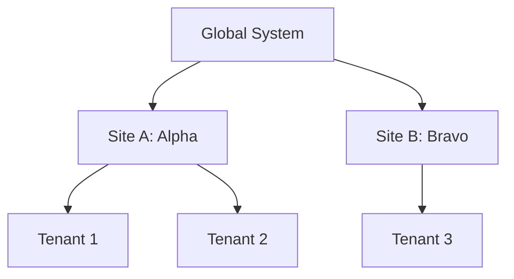

# Site Profile Overview

The **Site Profile** system is a specialized multi-tenancy architecture designed for scenarios where a single codebase must support multiple deployment variants ("sites") that diverge in database schema, business rules, and UI behavior.

## What is Site Profile?

Site Profile is a framework for deploying a single application across multiple sites where each site can have different database schemas, business rules, and column mappings. While traditional multi-tenancy focuses on **data isolation** (keeping Customer A's data away from Customer B), Site Profile focuses on **schema and logic divergence** (supporting Site A's legacy table names while Site B uses the modern standard).

## Site vs Tenant

In the Muonroi ecosystem, we differentiate between **Sites** and **Tenants**:

- **Site**: A deployment variant that defines the *structure* and *behavior*. (e.g., "TCI Site" has specific gRPC endpoints and custom column names).
- **Tenant**: An organization or customer that uses the application. (e.g., "Company A" and "Company B" both use the "TCI Site" but see only their own data).

A single **Site** can host multiple **Tenants**.

| Concept | Scope | Focus | Example |
| :--- | :--- | :--- | :--- |
| **Site** | Deployment / Variant | Schema, Rules, Mappings | TCI, Alpha, Bravo |
| **Tenant** | Data / Organization | Data Isolation, Quotas | Microsoft, Google, Acme Corp |



## When to Use Site Profile

Site Profile is ideal when you need to maintain a single core codebase but must satisfy diverse requirements across different deployment environments.

| Scenario | Use Site Profile? | Use Shared-Schema? |
| :--- | :--- | :--- |
| Same schema, different data per customer | No | **Yes** |
| Different column names per deployment | **Yes** | No |
| Different business rules per deployment | **Yes** | No |
| Extra columns for specific deployments | **Yes** | No |
| 70-80% shared schema, 20-30% different | **Yes** | No |

## Project Structure

A typical Site Profile project is organized into a shared `Core` library and multiple `Sites` projects that override or extend the core logic.

```text
MyProject/
├── src/
│   ├── MyProject.Core/          # 70-80% shared logic
│   │   ├── Contracts/           # Shared interfaces (IOrderService)
│   │   ├── Entities/            # Base entity classes
│   │   ├── Persistence/         # Base DbContext + configurations
│   │   └── Services/            # Base service implementations
│   ├── MyProject.Sites/
│   │   ├── Default/             # Default site (zero overrides)
│   │   ├── Alpha/               # Alpha site (custom column lengths)
│   │   ├── Bravo/               # Bravo site (extra columns, hooks)
│   │   └── Charlie/             # Charlie site (alias of Default)
│   └── MyProject.Host/          # Program.cs, gRPC services, API entry point
```

## How It Works (High-Level Flow)

1.  **Site Identification**: A request arrives with a site code (extracted from gRPC metadata, HTTP headers, or subdomains).
2.  **Resolution**: The `ISiteProfileResolver` identifies the correct `ISiteProfile` for the current request.
3.  **DI Dispatch**: Dependency Injection resolves keyed services specific to that site (e.g., `BravoOrderContext`, `BravoOrderService`).
4.  **Execution**: Business logic executes. If the site has specific overrides, they are used; otherwise, it falls back to the `Default` implementation.
5.  **Response**: The result is returned. The caller remains unaware of the site-specific implementation details.

## Site Code Resolution at Runtime

Site Profile routes every request to the correct site implementation using the `SiteCodeAccessor` delegate configured in `SiteInfrastructureOptions`. This delegate is a `Func<IServiceProvider, string?>` that you provide — the ecosystem does not prescribe how you obtain the site code.

```csharp
builder.Services.AddSiteInfrastructure(builder.Configuration, options =>
{
    // You decide where the site code comes from:
    // HTTP header, gRPC metadata, ambient state, etc.
    options.SiteCodeAccessor = sp =>
    {
        var httpContext = sp.GetRequiredService<IHttpContextAccessor>().HttpContext;
        return httpContext?.Request.Headers["X-Site-Code"].FirstOrDefault();
    };
    options.SiteAssemblies = [ typeof(BravoSiteProfile).Assembly ];
});
```

**Resolution flow:**

```
Request → SiteCodeAccessor delegate returns site code
       → ISiteProfileResolver.Resolve(siteCode)
       → Keyed DI: services registered for that site ID
```

The `ISiteProfileResolver` takes the site code string and resolves the matching `ISiteProfile`. This triggers keyed DI resolution — all site-specific services (DbContext, column maps, business logic) are automatically selected based on the site code.

:::tip Consumer pattern
Many consumers create a `WorkContext` or similar ambient accessor to centralize site code resolution. This is a consumer-level pattern, not an ecosystem requirement — `SiteCodeAccessor` only needs a `Func<IServiceProvider, string?>`.
:::

See [Adding a New Site](adding-a-new-site.md) for the full setup walkthrough.

## Service vs Aggregate Architecture

SiteProfile supports two project types:

| Type | Has DbContext? | Typical Use | `SkipDbContextRegistration` |
|------|---------------|-------------|----------------------------|
| **Service** | Yes | Direct DB access, EF Core queries | `false` (default) |
| **Aggregate** | No | Orchestration, gRPC client calls | `true` |

Service projects own the database — they have per-site DbContexts and entity configurations.
Aggregate projects orchestrate calls to service projects via gRPC — they have no DbContext,
only command handlers and gRPC facades.

```csharp
// Service project: has its own DbContext
[GenerateSiteProfile(SiteIds.BRAVO, typeof(BravoOrderContext))]

// Aggregate project: no DbContext, delegates via gRPC
[GenerateSiteProfile(SiteIds.BRAVO, typeof(object), SkipDbContextRegistration = true)]
```

## Packages

The system is distributed across several NuGet packages:

| Package | Purpose |
| :--- | :--- |
| `Muonroi.Tenancy.SiteProfile` | Core abstractions (`ISiteProfile`, `ISiteProfileResolver`). |
| `Muonroi.Tenancy.SiteProfile.Web` | Infrastructure for Web/API projects (DbContext, Dapper, Pipeline, Validation). |
| `Muonroi.Tenancy.SiteProfile.Grpc` | gRPC specific support (Interceptors, dispatchers, facades). |
| `Muonroi.Tenancy.SiteProfile.SourceGenerators` | Roslyn generators for automatic DI registration and scaffolding. |

## Source Files
- `src/Muonroi.Tenancy.SiteProfile/ISiteProfile.cs`
- `src/Muonroi.Tenancy.SiteProfile/ISiteProfileResolver.cs`
- `samples/TestProject.Service/` (Reference project structure)

## Template example: Modular template

The **Modular template** (`dotnet new muonroi-modular`) is the primary showcase for Site Profile. After generation, the `Modules/Catalog/` project contains a `CatalogSiteProfile` that registers catalog-specific infrastructure per site.

### CatalogSiteProfile skeleton

```csharp
// Modules/Catalog/SiteProfiles/CatalogSiteProfile.cs
using Muonroi.Tenancy.SiteProfile;

[GenerateSiteProfile(SiteIds.DEFAULT, typeof(CatalogDbContext))]
public class CatalogSiteProfile : ISiteProfile
{
    public string SiteId => SiteIds.DEFAULT;

    public void ConfigureServices(IServiceCollection services, IConfiguration configuration)
    {
        // Per-site overrides — e.g. custom column mappings or business rule sets
        // ISiteProfile.RegisterServices(IServiceCollection, IConfiguration) — verified against Muonroi.Tenancy.SiteProfile
        // Wire per-site DI: DbContext subclass, service overrides, custom mappers.
        // Example: services.AddDbContext<CatalogDbContext>(o => o.UseNpgsql(configuration.GetConnectionString("Catalog")));
    }
}
```

### appsettings block

Add the `SiteProfiles` block to `appsettings.json` in the Host project:

```json
{
  "SiteProfiles": {
    "Default": "default",
    "Sites": [
      { "SiteId": "default", "DisplayName": "Default Catalog" }
    ]
  }
}
```

### Wiring in the Host

In `Host/StartupExtensions.cs`, ensure the site profile infrastructure is registered:

```csharp
builder.Services.AddSiteInfrastructure(builder.Configuration, options =>
{
    options.SiteCodeAccessor = sp =>
        sp.GetRequiredService<IHttpContextAccessor>()
          .HttpContext?.Request.Headers["X-Site-Code"].FirstOrDefault() ?? "default";
    options.SiteAssemblies = [typeof(CatalogSiteProfile).Assembly];
});
```

This is the starting point. Extend `CatalogSiteProfile` with additional `[GenerateSiteProfile]` attributes for each site variant you need.

## Next Steps

- [Adding a New Site](adding-a-new-site.md) — Learn how to create your first site variant.
- [DbContext & Entities](dbcontext-and-entity-configuration.md) — Configure diverging database schemas.
- [Service Overrides](service-override-patterns.md) — Customize business logic per site.
