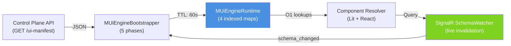
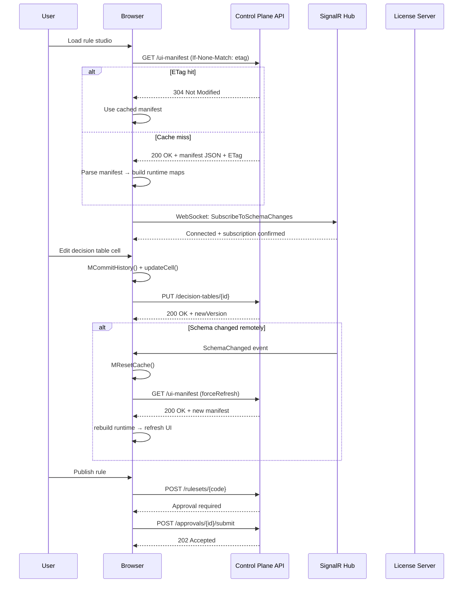

# UI Engine Architecture

## Overview

The Muonroi UI Engine is a schema-driven framework for building rule-authoring interfaces with zero-config runtime resolution. Built on TypeScript with Web Components (Lit), it provides 23 reusable custom elements that automatically bind to Muonroi rule definitions, decision tables, and flow graphs. The architecture prioritizes:

- **O(1) component lookup** via indexed manifest maps
- **Framework agnostic** — works in React, Angular, vanilla JS
- **ETag HTTP caching** with TTL manifest invalidation
- **License-aware rendering** — commercial components gate based on JWT tiers
- **Real-time schema sync** — SignalR watchers push changes to all clients

## Manifest-Driven Architecture

At startup, the UI Engine bootstraps a single source of truth: the **MUiEngineManifest**, a JSON schema defining all screens, actions, data sources, navigation, and component bindings.



## Runtime Maps (O(1) Lookup)

`MUiEngineRuntime` constructs 4 indexed maps during bootstrap for instant component resolution:

| Map | Key | Value | Lookup Time |
|-----|-----|-------|-------------|
| `mScreensByRoute` | route string | `MUiEngineScreen` | O(1) |
| `mScreensByKey` | screen.screenKey | `MUiEngineScreen` | O(1) |
| `mActionsByKey` | action.actionKey | `MUiEngineAction` | O(1) |
| `mDataSourcesByKey` | ds.dataSourceKey | `MUiEngineDataSource` | O(1) |

Visibility and enablement checks use standalone helper functions:
- `MCanRenderScreen(screen)` — checks `isVisible` + parent visibility
- `MCanRenderAction(action)` — checks `isVisible`
- `MCanExecuteAction(action)` — checks `isEnabled`

## Bootstrap Lifecycle (5 Phases)

The `MUiEngineBootstrapper` initializes the runtime with layered caching and contract validation:

```typescript
// Phase 1: Determine cache key
const cacheKey = `ui-manifest:${userId}:${tenantId}`

// Phase 2: TTL lookup
const cached = mCache.get(cacheKey)
if (cached && cached.expiresAtEpochMs > Date.now()) {
  return cached.manifest  // 60s default TTL
}

// Phase 3: Fetch fresh manifest
const manifest = await mProvider.LoadManifestAsync(manifestId)

// Phase 4: Build runtime + store in cache
const runtime = new MUiEngineRuntime(manifest)
mCache.set(cacheKey, { manifest, expiresAtEpochMs })

// Phase 5: Attach schema watcher
await mWatcher.SubscribeAsync()
mWatcher.OnSchemaChanged = async () => {
  mCache.delete(cacheKey)
  runtime = await LoadCurrentRuntime(forceRefresh: true)
}
```

**Telemetry events**: `cache_hit`, `cache_miss`, `manifest_loaded` (with elapsed ms), `manifest_invalid`, `schema_changed`

## Manifest Schema (v1 and v2)

The `MUiEngineManifest` defines the complete shape:

```typescript
interface MUiEngineManifest {
  schemaVersion: 'v1' | 'v2'           // Contract versioning
  screens: MUiEngineScreen[]            // Route-addressable pages
  actions: MUiEngineAction[]            // Global action registry
  dataSources: MUiEngineDataSource[]    // API endpoints + connectors
  navigationGroups: MUiEngineNavigationGroup[]
  componentRegistry: {                  // Component manifest overrides
    [componentKey: string]: {
      disabled?: boolean
      visibility?: 'always' | 'never' | 'conditional'
    }
  }
  appShell: {                           // Layout + theme config
    layoutType: 'sidebar' | 'topbar'
    theme: 'light' | 'dark' | 'auto'
  }
  authProfile: MUiEngineAuthProfile     // Token sourcing + refresh
  apiContracts: MUiEngineApiContract[]  // OpenAPI-like specs
  ruleBindings: {                       // Rule element ↔ API mapping
    [ruleKey: string]: {
      screenKey?: string
      actionKeys?: string[]
    }
  }
  generationHints?: {}                  // For AI-powered schema gen
}
```

**Key relationships**:
- Navigation nodes → screens via `screenKey`
- Screens → components → `dataSourceKey` + `actionKeys`
- Actions defined globally, reused across screens
- Rule bindings connect rules to UI elements

## Component Inventory

The UI Engine ships with **23 Lit custom elements** (all prefixed `mu-`):

### Core Components (OSS)
| Component | Purpose |
|-----------|---------|
| `mu-rule-explorer` | Tree view of rules + folder hierarchy |
| `mu-feel-editor` | FEEL expression editor with syntax highlighting |
| `mu-rule-test-runner` | Execute single rule with test inputs |
| `mu-upgrade-prompt` | License tier upsell component |
| `mu-quota-indicator` | Visual quota usage gauge |

### Decision Table Components (Commercial)
| Component | Purpose |
|-----------|---------|
| `mu-decision-table` | Main table editor with virtualized rendering |
| `mu-decision-table-list` | Browse all decision tables |
| `mu-dt-header-row` | Editable column headers |
| `mu-dt-data-row` | Data entry rows, 44px height |
| `mu-dt-cell` | Individual cell with FEEL evaluation |
| `mu-dt-hit-policy-selector` | Hit policy dropdown (First/Unique/Collect/Priority) |
| `mu-dt-column-config` | Column type + I/O configuration |
| `mu-dt-version-diff` | Side-by-side diff viewer |

### Rule Flow Components (Commercial)
| Component | Purpose |
|-----------|---------|
| `mu-rule-flow-designer` | Visual flow editor (Lit + React hybrid) |
| `mu-nrules-editor` | NRules DSL editor with syntax check |
| `mu-nrules-condition` | Condition node inspector |
| `mu-nrules-action` | Action node inspector |

### Advanced Components (Commercial)
| Component | Purpose |
|-----------|---------|
| `mu-cep-window-config` | Complex event processing window setup |
| `mu-cep-event-stream` | Stream event simulation |
| `mu-feel-playground` | Interactive FEEL expression tester |
| `mu-feel-autocomplete` | FEEL context-aware suggestions |
| `mu-rule-trace-viewer` | Step-through execution debugger |
| `mu-rule-result-panel` | Formatted result display |
| `mu-schema-watcher` | Real-time schema change detector |
| `mu-ui-engine-app` | Full-featured rule authoring shell |

## Decision Table Widget Deep Dive

The `mu-decision-table` component is the most complex, optimized for 1000+ row tables:

### Virtualized Rendering
- **Row height**: Fixed 44px (no variable heights)
- **Viewport**: 420px visible area
- **Rendered rows**: ~45 visible at a time (10-row buffer above/below)
- **Spacers**: top/bottom DOM elements to maintain scroll position
- **Memory**: O(1) for 10,000 rows (only 45 in DOM)

### Undo/Redo Stack
- **Limit**: 50 actions max per session
- **Trigger**: every mutation calls `MCommitHistory()` BEFORE state change
- **Stack**: past[] (clone of state), future[] (for redo)
- **Normalization**: `MNormalizeTable()` deep-clones via JSON to ensure immutability

### Version Diff View
```typescript
// Load two versions in parallel
const v1 = await api.GetDecisionTableVersion(tableId, 5)
const v2 = await api.GetDecisionTableVersion(tableId, 6)

// Server-side diff (POST /diff)
const diff = await api.DiffVersions(tableId, 5, 6)
// Returns: { addedRows: [], deletedRows: [], changedCells: [] }

// Render side-by-side with highlights
```

### Store Integration (Zustand)
```typescript
// Factory pattern: MCreateDecisionTableStore()
const store = zustand.createStore<DecisionTableStore>(
  (set, get) => ({
    table: null,
    past: [],
    future: [],

    loadTable: async (id) => {
      const table = await api.GetDecisionTable(id)
      set({ table, past: [], future: [] })
    },

    updateCell: (rowIdx, colIdx, value) => {
      const clone = JSON.parse(JSON.stringify(get().table))
      get().past.push(clone)  // Commit BEFORE mutation
      clone.rows[rowIdx].cells[colIdx].value = value
      set({ table: clone, future: [] })
      api.SaveDecisionTable(clone)  // Async, fire-and-forget
    },

    undo: () => {
      if (get().past.length === 0) return
      const prev = get().past.pop()
      get().future.push(get().table)
      set({ table: prev })
    }
  })
)
```

## Rule Flow Designer (Lit + React Hybrid)

The flow designer uses an unconventional pattern: **Lit shadow DOM host with React subtree inside**.

```typescript
export class MuRuleFlowDesigner extends LitElement {
  private mReactRoot: React.Root

  override connectedCallback() {
    super.connectedCallback()

    // Mount React component inside shadow DOM
    const shadowRoot = this.shadowRoot
    const container = document.createElement('div')
    shadowRoot.appendChild(container)

    this.mReactRoot = createRoot(container)
    this.mReactRoot.render(
      <MuRuleFlowEditor
        graph={this.mGraph}
        onChange={this.handleGraphChange.bind(this)}
        onPublish={this.handlePublish.bind(this)}
      />
    )
  }

  private handleGraphChange(newGraph: MRuleFlowGraph) {
    this.mInternalGraphUpdate = true  // Prevent infinite loops
    this.mGraph = newGraph
    this.requestUpdate()
    this.mInternalGraphUpdate = false
  }

  private async handlePublish() {
    // Convert graph → RuleSet JSON
    const ruleSet = await MRuleFlowGraphConverter.toRuleSetAsync(
      this.mGraph,
      this.workflowName
    )

    // Save via API
    const resp = await this.apiClient.SaveRuleSet(ruleSet)

    if (this.approvalRequired) {
      // Submit for approval workflow
      await this.apiClient.SubmitForApproval(resp.id)
    } else {
      // Direct activation
      await this.apiClient.ActivateRuleSet(resp.id)
    }
  }
}
```

### Graph Synchronization
- **Parse**: `MSyncGraphFromJson()` validates incoming JSON
- **Signature**: Stored to detect external changes (via SignalR)
- **Reload**: `MRuleFlowGraphConverter.fromRuleSet()` reconstructs graph from rule JSON
- **Conflict**: If signature mismatch detected, prompt user to reload

## Zustand Vanilla Stores (Framework-Agnostic State)

All stateful components use **Zustand vanilla (non-React) stores** via the factory pattern:

```typescript
// Decision table store
export const MCreateDecisionTableStore = () =>
  createStore<DecisionTableStore>((set, get) => ({...}))

// Rule engine store
export const MCreateRuleEngineStore = () =>
  createStore<RuleEngineStore>((set, get) => ({...}))
```

**Benefits**:
- Works with Lit, React, Angular, vanilla JS (no coupling)
- TypeScript generics for type safety
- Unidirectional flow: store → component state subscription
- Write via `store.getState().action()`

## HTTP Caching Strategy

The `MUiEngineApiClient` implements two-tier caching:

### ETag (HTTP 304)
```typescript
// Store ETags per request path
private mETagMap = new Map<string, { etag: string; cached: T }>()

async get<T>(url: string): Promise<T> {
  const cached = this.mETagMap.get(url)

  const headers = {}
  if (cached) {
    headers['If-None-Match'] = cached.etag
  }

  const resp = await fetch(url, { headers })

  if (resp.status === 304) {
    return cached.cached  // Server says: not modified
  }

  const data = await resp.json()
  const etag = resp.headers.get('ETag')
  this.mETagMap.set(url, { etag, cached: data })
  return data
}
```

### Request Headers
```typescript
export interface MHttpRequestConfig {
  Authorization: `Bearer ${string}`
  'X-Tenant-Id': string
  'Accept-Language': string
  'X-Correlation-Id': string  // crypto.randomUUID()
}
```

## License Verification (MLicenseVerifier)

Commercial components check license tier at runtime using JWT validation:

```typescript
export class MLicenseVerifier {
  private mLicense: MUiEngineLicense | null = null

  initialize(jwtToken: string) {
    // Parse JWT: header.payload.signature
    const [header, payload, signature] = jwtToken.split('.')

    // Verify RS256 signature with public key
    const verified = crypto.subtle.verify(
      'RSASSA-PKCS1-v1_5',
      publicKey,
      base64urlToBuffer(signature),
      new TextEncoder().encode(`${header}.${payload}`)
    )

    if (!verified) throw new Error('Invalid license')

    // Decode payload
    const claims = JSON.parse(base64urlDecode(payload))

    // Check nbf (not before) and exp (expiration)
    const now = Math.floor(Date.now() / 1000)
    if (claims.nbf > now || claims.exp < now) {
      throw new Error('License expired')
    }

    this.mLicense = {
      tier: claims.tier,           // free|licensed|enterprise
      features: claims.features || [],
      tenantId: claims.tenantId,
      expiresAt: new Date(claims.exp * 1000)
    }
  }

  hasFeature(key: string): boolean {
    return this.mLicense?.features.includes(key) ?? false
  }

  hasAnyFeature(candidates: string[]): boolean {
    return candidates.some(c => this.hasFeature(c))
  }
}
```

**Tiers**:
- `Free` — basic read-only, no rule editing
- `Licensed` — standard features, rule editing allowed
- `Enterprise` — all commercial components + advanced features

## Commercial Feature Gating

The `m-commercial-guard.ts` module gates component visibility:

```typescript
export function MCanRenderCommercialFeature(key: string): boolean {
  const candidates = MResolveFeatureCandidates(key)
  // Feature aliases: "decision-table" → ["rule-components.decision-table"]
  // Wildcard: "*" in license features grants all
  return MLicenseVerifier.hasAnyFeature(candidates)
}

export function MRenderCommercialLicenseGate(tier: string) {
  return (
    <div className="license-gate">
      <p>Upgrade to {tier} to unlock this feature</p>
      <a href={PRICING_URL}>View Plans</a>
    </div>
  )
}
```

**Feature Aliases**:
| UI Component | License Feature |
|---|---|
| `mu-decision-table` | `rule-components.decision-table` |
| `mu-rule-flow-designer` | `rule-components.rule-flow-designer` |
| `mu-feel-autocomplete` | `rule-components.feel-autocomplete` |
| `mu-rule-trace-viewer` | `rule-components.rule-trace-viewer` |
| All others | `rule-components.*` |

## SignalR Schema Watcher

Real-time schema changes are broadcast to all connected clients via SignalR:

```typescript
export class MUiEngineSignalRSchemaWatcher {
  private mConnection: HubConnection

  constructor(private mEndpoint: string, private mAccessToken: string) {
    this.mConnection = new HubConnectionBuilder()
      .withUrl(mEndpoint, {
        accessTokenFactory: () => mAccessToken,
        headers: {
          'X-Tenant-Id': getCurrentTenantId()
        }
      })
      .withAutomaticReconnect()
      .build()
  }

  async subscribe(): Promise<void> {
    this.mConnection.on('SchemaChanged', (event: SchemaChangedEvent) => {
      console.log(`Schema changed: ${event.changeType}`)
      // Trigger full cache invalidation
      MResetCache()
      // Reload runtime
      MLoadCurrentRuntime(forceRefresh: true)
    })

    await this.mConnection.start()
    await this.mConnection.invoke('SubscribeToSchemaChanges')
  }

  async unsubscribe(): Promise<void> {
    await this.mConnection.invoke('UnsubscribeFromSchemaChanges')
    await this.mConnection.stop()
  }
}
```

**Integration**: Bootstrapper attaches watcher in Phase 5, automatically reloads on schema changes.

## Package Structure (8 npm Packages)

### Open Source
| Package | Purpose |
|---------|---------|
| `@muonroi/m-ui-engine-core` | Runtime, bootstrap, contracts |
| `@muonroi/m-ui-engine-react` | React adapter + hooks |
| `@muonroi/m-ui-engine-angular` | Angular route/menu mappers |
| `@muonroi/m-ui-engine-primeng` | PrimeNG component adapter |

### Commercial
| Package | Purpose |
|---------|---------|
| `@muonroi/m-ui-engine-rule-components` | 23 Lit custom elements |
| `@muonroi/m-ui-engine-signalr` | SignalR schema watcher |
| `@muonroi/m-ui-engine-sync-tooling` | Manifest sync utilities |
| `@muonroi/m-ui-engine-license-tools` | JWT verification helpers |

All packages exported from monorepo with shared Zustand stores and license verification.

## Data Flow Diagram



## Performance Characteristics

| Operation | Time Complexity | Notes |
|-----------|-----------------|-------|
| Component lookup | O(1) | 4 indexed maps |
| Decision table render | O(45) | Virtualized, 45 visible rows |
| TTL cache hit | O(1) | Epoch check + map lookup |
| ETag check | O(1) | Header comparison |
| Manifest parse | O(V+E) | Schema validation (vertex + edges) |
| Undo/Redo | O(1) | Append + pop from arrays |
| Table diff | O(rows) | Server-side computation |

**Typical latencies** (lab conditions):
- Cold boot: 200-400ms (manifest fetch + parse)
- Warm boot: 50-100ms (cache hit)
- Cell update: 150-300ms (API round-trip)
- Schema reload: 100-200ms (cache clear + re-init)

## Cross-References

- [Decision Table Widget](/docs/guides/ui-engine/decision-table-widget) — virtualization + undo/redo detailed
- [Rule Flow Designer](/docs/guides/ui-engine/rule-flow-designer) — graph editing + publish workflow
- [FEEL Autocomplete Widget](/docs/guides/ui-engine/feel-autocomplete-widget) — context-aware suggestions

## See Also

- [License Verification](/docs/governance/license-protection) — JWT RS256 validation
- [Control Plane API](/docs/guides/control-plane/api-reference) — manifest + rule endpoints
- [Multi-Tenancy](/docs/architecture/multi-tenancy) — tenant context propagation
