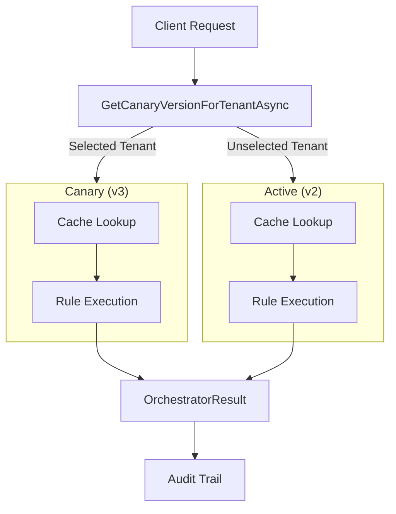

# Canary and Shadow Deployment

Canary rollouts and shadow evaluation strategies let you validate rule behavior in production with minimal risk. Canary routes real traffic to a new ruleset version for selected tenants or a percentage of requests. Shadow runs a candidate ruleset in parallel without routing traffic to it, comparing outputs to decide whether promotion is safe.

## Problem

Deploying a new ruleset version to all tenants at once risks cascading failures if the version contains bugs. You need ways to:

- Test new versions against real production traffic before full rollout
- Compare outputs between an active version and a candidate without affecting users
- Roll back quickly if issues arise
- Make data-driven promotion decisions based on execution metrics

Canary and shadow deployment patterns solve this.

---

## Canary Rollout

Canary gradually routes traffic to a new ruleset version, keeping the active version as a fallback. You control which tenants (or what percentage of requests) use the new version. Monitor audit trails and error rates, then promote to active or rollback.

### Architecture



### Execution Flow

1. **Start Canary**: POST `/api/v1/canary` with target workflow, new version, percentage/tenant list
2. **Tenant Dispatch**: Before rule execution, `GetCanaryVersionForTenantAsync` checks if tenant is in canary target
3. **Dual Cache**: Canary uses separate cache key; active version uses standard cache
4. **Execution**: Both versions run normally through the RuleOrchestrator pipeline
5. **Audit**: Execution recorded with version tag (active or canary) in audit trail
6. **Monitor**: Check metrics via audit endpoints or SignalR notifications
7. **Promote or Rollback**: POST promote to make canary the new active, or POST rollback to stop

### API: Start Canary

Start a canary rollout for a workflow:

```bash
curl -X POST https://cp.truyentm.xyz/api/v1/canary \
  -H "Authorization: Bearer $TOKEN" \
  -H "Content-Type: application/json" \
  -d '{
    "workflowName": "OrderApproval",
    "version": 3,
    "targetPercentage": 25,
    "targetTenantIds": null
  }'
```

**Response** (201):

```json
{
  "rolloutId": "f47ac10b-58cc-4372-a567-0e02b2c3d479",
  "workflowName": "OrderApproval",
  "version": 3,
  "status": "Active",
  "createdAt": "2026-03-20T10:15:00Z",
  "targetPercentage": 25,
  "targetTenantIds": null
}
```

**Parameters**:
- `workflowName` (required): Name of the ruleset
- `version` (required): Version number to canary (must exist and not be active)
- `targetPercentage` (optional): Route to new version for this % of requests (1–100)
- `targetTenantIds` (optional): Route specific tenant IDs to new version (list)

**Note**: Specify either `targetPercentage` OR `targetTenantIds`, not both. If both null, defaults to 1% traffic.

### API: List Canaries

See all active canary rollouts:

```bash
curl https://cp.truyentm.xyz/api/v1/canary \
  -H "Authorization: Bearer $TOKEN"
```

**Response**:

```json
[
  {
    "rolloutId": "f47ac10b-58cc-4372-a567-0e02b2c3d479",
    "workflowName": "OrderApproval",
    "version": 3,
    "status": "Active",
    "createdAt": "2026-03-20T10:15:00Z",
    "targetPercentage": 25,
    "promotedAt": null,
    "rolledBackAt": null
  }
]
```

### API: Promote Canary

After validating the canary version, promote it to active:

```bash
curl -X POST https://cp.truyentm.xyz/api/v1/canary/{rolloutId}/promote \
  -H "Authorization: Bearer $TOKEN"
```

**Response** (200):

```json
{
  "rolloutId": "f47ac10b-58cc-4372-a567-0e02b2c3d479",
  "status": "Promoted",
  "promotedAt": "2026-03-20T14:30:00Z"
}
```

**Effects**:
- New version becomes active for all tenants
- Active version increments to the new number
- Previous active version remains as historical record (can still run in shadow mode)

### API: Rollback Canary

If canary execution shows issues, rollback immediately:

```bash
curl -X POST https://cp.truyentm.xyz/api/v1/canary/{rolloutId}/rollback \
  -H "Authorization: Bearer $TOKEN" \
  -H "Content-Type: application/json" \
  -d '{
    "reason": "High error rate on large order amounts (>$50k)"
  }'
```

**Response** (200):

```json
{
  "rolloutId": "f47ac10b-58cc-4372-a567-0e02b2c3d479",
  "status": "RolledBack",
  "rolledBackAt": "2026-03-20T10:45:00Z",
  "reason": "High error rate on large order amounts (>$50k)"
}
```

**Effects**:
- Canary routing stopped immediately
- All traffic reverts to previously active version
- Rollout record retained in audit trail

---

## Shadow Evaluation

Shadow runs a candidate ruleset **without routing traffic to it**, comparing outputs to the active version. You use Shadow to:

- Validate logic changes against real production data
- Compare outputs deterministically before exposing tenants
- Measure performance impact safely
- Detect regressions in decision tables or flow graph changes

### Execution Mode: Shadow

The execution router has four modes. **Shadow** runs both the active and candidate versions, logs the differences, and returns the active version's result to the client:

| Mode | Behavior |
|------|----------|
| **Traditional** | Execute traditional code path (no rules) |
| **Rules** | Execute active ruleset version only |
| **Hybrid** | Probabilistically split traffic between traditional and rules |
| **Shadow** | Execute both active and candidate, log diff, return active result |

### Architecture

```mermaid
graph TB
    Input["Input Facts"]
    Router["Execution Router<br/>Mode: Shadow"]

    subgraph Active["Active Version"]
        ActiveEval["EvaluateAsync"]
        ActiveExec["ExecuteAsync"]
    end

    subgraph Candidate["Candidate Version"]
        CandidateEval["EvaluateAsync"]
        CandidateExec["ExecuteAsync (No Side Effects)"]
    end

    Diff["Diff Comparison"]
    Log["Audit Log"]
    Result["Return Active Result"]

    Input --> Router
    Router -->|Execute| Active
    Router -->|Execute (No Side Effects)| Candidate
    Active --> Diff
    Candidate --> Diff
    Diff --> Log
    Active --> Result
```

**Key Property**: Shadow **does not execute side effects** from the candidate version. Only output facts are compared.

### Shadow Setup

To enable shadow mode for a workflow:

1. Create a new ruleset version and validate it (dry-run)
2. Configure the execution router to use Shadow mode:

**appsettings.json**:

```json
{
  "RuleEngineOptions": {
    "ExecutionRouter": {
      "Mode": "Shadow",
      "ActiveVersion": 2,
      "CandidateVersion": 3,
      "ComparisonStrategies": ["OutputFacts", "ExecutionTime"]
    }
  }
}
```

Alternatively, set via environment:

```bash
export RULEENGINE_EXECUTIONROUTER_MODE=Shadow
export RULEENGINE_EXECUTIONROUTER_CANDIDATEVERSION=3
```

3. On each request, the router:
   - Executes active version (v2) → returns result to client
   - Executes candidate version (v3) in parallel
   - Compares output facts
   - Logs diff to audit trail and metrics

### Comparing Shadow Results

Shadow differences are recorded in the audit trail with diff metadata:

```bash
curl https://cp.truyentm.xyz/api/v1/audit/workflow/OrderApproval \
  -H "Authorization: Bearer $TOKEN" \
  -H "x-tenant-id: tenant-123" | jq '.[] | select(.shadowDiff != null)'
```

**Sample Audit Entry**:

```json
{
  "workflowName": "OrderApproval",
  "version": 2,
  "correlationId": "req-98765",
  "tenantId": "tenant-123",
  "executedAt": "2026-03-20T10:22:15Z",
  "executionTimeMs": 42,
  "shadowDiff": {
    "candidateVersion": 3,
    "differences": [
      {
        "field": "approvalRequired",
        "activeValue": true,
        "candidateValue": false,
        "severity": "high"
      },
      {
        "field": "discountRate",
        "activeValue": 0.1,
        "candidateValue": 0.15,
        "severity": "medium"
      }
    ]
  }
}
```

### Diff Severity Levels

- **Green** (no diff): Candidate output matches active output exactly
- **Yellow** (medium): Numeric differences ≤5% or output field counts match
- **Red** (high): Boolean logic differs or critical output fields missing

### Dashboard: Shadow Analysis

The Control Plane dashboard includes a **Shadow Analysis** page showing:

1. **Diff Distribution**: Pie chart of exact-match vs medium vs high diffs
2. **Timeline**: Diffs over time, grouped by hour
3. **Field Impact**: Which output fields differ most frequently
4. **Regression Alert**: If diff count spikes (potential regression)

---

## Monitoring

### Canary Audit Trail

All canary executions are tagged in the audit trail:

```bash
curl 'https://cp.truyentm.xyz/api/v1/audit/workflow/OrderApproval?pageSize=50' \
  -H "Authorization: Bearer $TOKEN" | jq '.items[] | {
    correlationId,
    version,
    executionTimeMs,
    rulesMatched
  }' | head -20
```

Filter by version to compare active vs canary:

```bash
curl 'https://cp.truyentm.xyz/api/v1/audit/workflow/OrderApproval' \
  -H "Authorization: Bearer $TOKEN" \
  -H "x-tenant-id: canary-tenant-001"
```

### Metrics: Error Rate

Monitor error rates via OpenTelemetry or application metrics:

```
rule.engine.errors{workflow=OrderApproval,version=3,status=canary}
rule.engine.errors{workflow=OrderApproval,version=2,status=active}
```

**Alert Rule** (Prometheus):

```prometheus
(
  rate(rule_engine_errors{status="canary"}[5m])
  /
  rate(rule_engine_errors{status="active"}[5m])
) > 1.5
```

If canary error rate exceeds active by 50%, trigger rollback.

### SignalR Notifications

Subscribe to canary state changes via SignalR:

**JavaScript**:

```javascript
const connection = new signalR.HubConnectionBuilder()
  .withUrl("https://cp.truyentm.xyz/hubs/ruleset-changes")
  .withAutomaticReconnect()
  .build();

connection.on("CanaryStateChanged", (event) => {
  console.log(`Canary for ${event.workflowName}:`, event.status);
  // status: Active | Promoted | RolledBack
});

await connection.start();
```

---

## Best Practices

### Canary Percentage Strategy

| Scenario | Recommended % | Duration |
|----------|---------------|----------|
| Small logic fix | 5–10% | 4–6 hours |
| Decision table change | 10–25% | 8–12 hours |
| Flow graph refactor | 1–5% | 24 hours |
| New connector integration | 1% | 24–48 hours |

### Canary Success Criteria

Before promoting, verify:

1. **Error rate**: ≤ active version's rate
2. **Latency**: No increase > 10%
3. **Audit completeness**: All tenants executed at least once
4. **No regressions**: Output facts align with expected behavior
5. **Manual testing**: Spot-check 3–5 high-value requests

### Shadow Best Practices

1. **Start shadow before canary**: Run shadow for 24 hours, review diffs, then start canary
2. **Use representative tenants**: If shadowing subset, choose tenants with diverse rule logic
3. **Monitor diff severity**: Yellow diffs are normal; red diffs warrant investigation
4. **Automate diff review**: Set up a diff dashboard or alert on high-diff hours
5. **Keep candidate version locked**: Don't edit candidate while shadow is running

### Rollback Criteria

Rollback immediately if:

- Error rate > 5x active version
- Timeout rate > 10% of requests
- Revenue-impacting logic regression detected
- Data consistency violations in audit trail

---

## Troubleshooting

### Canary Not Routing

**Symptom**: Canary started, but audit trail shows 0% of canary tenants executing new version.

**Cause**: Tenant not in target list or percentage not applied.

**Fix**:
1. Verify tenant ID: `curl https://cp.truyentm.xyz/api/v1/tenants -H "Authorization: Bearer $TOKEN"`
2. Check canary config: `curl https://cp.truyentm.xyz/api/v1/canary -H "Authorization: Bearer $TOKEN"`
3. Restart rule engine cache: `POST /api/v1/control-plane/cache/invalidate`

### High Error Rate in Canary

**Symptom**: Canary version errors exceed 20% of requests.

**Cause**: New version has invalid FEEL expressions, missing inputs, or logic bug.

**Fix**:
1. Dry-run the candidate version locally with representative data
2. Export and review the candidate ruleset: `GET /api/v1/rulesets/OrderApproval/versions/3`
3. Fix, increment to v4, validate, and start new canary

### Shadow Diff Explosion

**Symptom**: Shadow diffs spike to 80%+ high-severity, all on the same field.

**Cause**: Candidate version has a breaking change in a shared output field.

**Fix**:
1. Review the field value source: decision table hit policy or FEEL expression?
2. Compare v2 and v3 side-by-side: `GET /api/v1/rulesets/OrderApproval/versions/{2,3}`
3. Use decision table diff: `muonroi-rule diff --table discountTable --from-version 2 --to-version 3`
4. Roll candidate version back and revert the breaking change

---

## Related Guides

- [**Ruleset Governance Ops**](./ruleset-governance-ops.md): How to save, validate, and activate rulesets
- [**Dry Run Operations**](./dry-run.md): Test rule behavior with isolated requests
- [**Control Plane Operator**](./control-plane-operator.md): API surface and authentication
- [**Observability Guide**](./observability-guide.md): Metrics, tracing, and audit trail configuration
