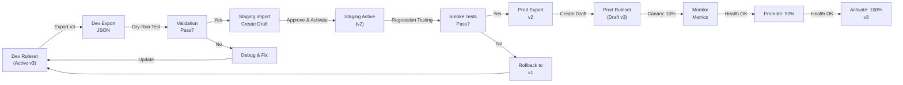

# Ruleset Governance Operations

Runtime ruleset governance keeps code-first and operator-managed flows connected. This guide covers CRUD operations, version control, environment promotion, and backup/restore procedures for production rulesets.

## Overview

Rulesets move through three operational states:
- **Draft** — created, under development, not active
- **Approved** — reviewed and signed off, ready for activation
- **Active** — currently executing in runtime, served from cache

Governance relies on:
- **Version history** — immutable snapshots of ruleset state
- **Audit trail** — who changed what, when, and why
- **Canary rollouts** — gradual activation by tenant percentage
- **Environment promotion** — dev → staging → production with validation

## API Surface

Base route: `/api/v1/rule-engine/rulesets`

### Core Endpoints

| Method | Endpoint | Purpose |
|--------|----------|---------|
| `GET` | `/` | List all rulesets (workflows) |
| `GET` | `/{workflowName}/versions` | List versions for a ruleset |
| `GET` | `/{workflowName}/versions/{version}` | Get specific version |
| `POST` | `/{workflowName}/save` | Create new version (draft) |
| `POST` | `/{workflowName}/activate` | Activate a version |
| `POST` | `/{workflowName}/validate` | Validate payload syntax |
| `POST` | `/{workflowName}/dry-run` | Test payload without side effects |
| `POST` | `/{workflowName}/export` | Export as JSON/YAML |
| `GET` | `/{workflowName}/audit` | Inspect change history |
| `POST` | `/{workflowName}/versions/{v1}/diff/{v2}` | Compare two versions |

### Approval Endpoints

These endpoints are only active when `RuleControlPlane:RequireApproval=true` (the production default). See [Ruleset Approval Workflow](../03-guides/control-plane/ruleset-approval-workflow.md) for the full maker-checker pattern.

Base route: `/api/v1/control-plane`

| Method | Endpoint | Policy | Purpose |
|--------|----------|--------|---------|
| `POST` | `/rulesets/{workflow}/{version}/submit` | Admin | Submit a draft version for review; moves state to `PendingApproval` |
| `POST` | `/rulesets/{workflow}/{version}/approve` | Approver | Approve a pending-approval version; moves state to `Approved` |
| `POST` | `/rulesets/{workflow}/{version}/reject` | Approver | Reject a pending-approval version with a mandatory `reason`; reverts to `Draft` |

**Conflict responses (`409 Conflict`)** are returned for:
- Self-approval (the actor who submitted cannot approve the same version)
- Wrong state transitions (e.g. approving an already-active version)

## CRUD Operations

### List All Rulesets

```bash
curl -X GET https://cp.truyentm.xyz/api/v1/rule-engine/rulesets \
  -H "Authorization: Bearer $JWT_TOKEN" \
  -H "x-tenant-id: tenant-acme"
```

Response:
```json
{
  "rulesets": [
    {
      "workflowName": "order-approval",
      "activeVersion": 5,
      "totalVersions": 8,
      "lastModified": "2026-03-20T14:32:00Z",
      "modifiedBy": "ops-team"
    }
  ]
}
```

### List Versions

```bash
curl -X GET "https://cp.truyentm.xyz/api/v1/rule-engine/rulesets/order-approval/versions" \
  -H "Authorization: Bearer $JWT_TOKEN" \
  -H "x-tenant-id: tenant-acme"
```

### Get Specific Version

```bash
curl -X GET "https://cp.truyentm.xyz/api/v1/rule-engine/rulesets/order-approval/versions/5" \
  -H "Authorization: Bearer $JWT_TOKEN" \
  -H "x-tenant-id: tenant-acme"
```

### Create New Version (Save Draft)

```bash
curl -X POST https://cp.truyentm.xyz/api/v1/rule-engine/rulesets/order-approval/save \
  -H "Authorization: Bearer $JWT_TOKEN" \
  -H "x-tenant-id: tenant-acme" \
  -H "Content-Type: application/json" \
  -d '{
    "rules": [
      {
        "id": "rule-1",
        "name": "High-Value Orders",
        "condition": "amount > 10000",
        "output": {
          "requiresApproval": true,
          "approvalLevel": "executive"
        }
      }
    ],
    "changeDescription": "Add executive approval for orders > $10k"
  }'
```

Response:
```json
{
  "version": 6,
  "status": "draft",
  "createdAt": "2026-03-20T14:35:00Z",
  "createdBy": "ops-team"
}
```

### Activate Version

```bash
curl -X POST https://cp.truyentm.xyz/api/v1/rule-engine/rulesets/order-approval/activate \
  -H "Authorization: Bearer $JWT_TOKEN" \
  -H "x-tenant-id: tenant-acme" \
  -H "Content-Type: application/json" \
  -d '{
    "version": 6,
    "detail": "Activate executive approval rules",
    "actor": "ops-team"
  }'
```

## Version Control & Comparison

### Export Ruleset

```bash
# Export active version
curl -X POST https://cp.truyentm.xyz/api/v1/rule-engine/rulesets/order-approval/export \
  -H "Authorization: Bearer $JWT_TOKEN" \
  -H "x-tenant-id: tenant-acme" \
  -d '{"format": "json"}' > order-approval-active.json

# Export specific version
curl -X POST https://cp.truyentm.xyz/api/v1/rule-engine/rulesets/order-approval/export \
  -H "Authorization: Bearer $JWT_TOKEN" \
  -H "x-tenant-id: tenant-acme" \
  -d '{"version": 4, "format": "json"}' > order-approval-v4.json
```

### Compare Versions (Diff)

```bash
curl -X GET "https://cp.truyentm.xyz/api/v1/rule-engine/rulesets/order-approval/versions/4/diff/5" \
  -H "Authorization: Bearer $JWT_TOKEN" \
  -H "x-tenant-id: tenant-acme"
```

Response:
```json
{
  "fromVersion": 4,
  "toVersion": 5,
  "changes": {
    "added": [
      {
        "id": "rule-3",
        "name": "Fraud Detection"
      }
    ],
    "modified": [
      {
        "id": "rule-1",
        "fieldChanges": {
          "condition": {
            "old": "amount > 5000",
            "new": "amount > 10000"
          }
        }
      }
    ],
    "removed": []
  }
}
```

## Validation & Testing

### Validate Payload

```bash
curl -X POST https://cp.truyentm.xyz/api/v1/rule-engine/rulesets/order-approval/validate \
  -H "Authorization: Bearer $JWT_TOKEN" \
  -H "x-tenant-id: tenant-acme" \
  -H "Content-Type: application/json" \
  -d '{
    "rules": [...],
    "decisionTables": [...]
  }'
```

### Dry-Run (Test Execution)

```bash
curl -X POST https://cp.truyentm.xyz/api/v1/rule-engine/rulesets/order-approval/dry-run \
  -H "Authorization: Bearer $JWT_TOKEN" \
  -H "x-tenant-id: tenant-acme" \
  -H "Content-Type: application/json" \
  -d '{
    "inputs": {
      "customerId": "CUST-001",
      "amount": 12500,
      "riskScore": 0.85
    },
    "version": 5
  }'
```

Response:
```json
{
  "executionId": "exec-abc123",
  "status": "success",
  "outputs": {
    "requiresApproval": true,
    "approvalLevel": "executive",
    "reasonCode": "HIGH_VALUE_HIGH_RISK"
  },
  "executionTime": "45ms",
  "rulesExecuted": 3,
  "sideEffectsApplied": false
}
```

## Audit Trail

### View Audit History

```bash
curl -X GET "https://cp.truyentm.xyz/api/v1/rule-engine/rulesets/order-approval/audit?page=1&pageSize=20" \
  -H "Authorization: Bearer $JWT_TOKEN" \
  -H "x-tenant-id: tenant-acme"
```

Response:
```json
{
  "entries": [
    {
      "timestamp": "2026-03-20T14:35:00Z",
      "actor": "ops-team",
      "action": "SAVE",
      "version": 6,
      "detail": "Add executive approval for orders > $10k",
      "status": "success"
    },
    {
      "timestamp": "2026-03-19T10:15:00Z",
      "actor": "platform-bot",
      "action": "ACTIVATE",
      "version": 5,
      "status": "success"
    }
  ],
  "total": 42,
  "page": 1
}
```

## MCP Tools for Operations

### Using muonroi-control-plane MCP Server

#### List Rulesets

```bash
# MCP function: muonroi_ruleset_list
# Returns all rulesets in current tenant
curl -X POST https://cp.truyentm.xyz/sse \
  -H "Content-Type: application/json" \
  -d '{
    "method": "muonroi_ruleset_list"
  }'
```

#### Get Ruleset Versions

```bash
# MCP function: muonroi_ruleset_get_versions
# Args: workflowName (string)
curl -X POST https://cp.truyentm.xyz/sse \
  -H "Content-Type: application/json" \
  -d '{
    "method": "muonroi_ruleset_get_versions",
    "args": {"workflowName": "order-approval"}
  }'
```

#### Export Ruleset

```bash
# MCP function: muonroi_ruleset_export
# Args: workflowName, version (optional, defaults to active)
curl -X POST https://cp.truyentm.xyz/sse \
  -H "Content-Type: application/json" \
  -d '{
    "method": "muonroi_ruleset_export",
    "args": {
      "workflowName": "order-approval",
      "version": 5
    }
  }'
```

#### Save Ruleset Version

```bash
# MCP function: muonroi_ruleset_save
# Args: workflowName, ruleSet (JSON), detail, actor
curl -X POST https://cp.truyentm.xyz/sse \
  -H "Content-Type: application/json" \
  -d '{
    "method": "muonroi_ruleset_save",
    "args": {
      "workflowName": "order-approval",
      "ruleSet": {
        "rules": [...],
        "decisionTables": [...]
      },
      "detail": "Update fraud rules",
      "actor": "ops-team"
    }
  }'
```

#### Activate Ruleset

```bash
# MCP function: muonroi_ruleset_activate
# Args: workflowName, version, detail, actor
curl -X POST https://cp.truyentm.xyz/sse \
  -H "Content-Type: application/json" \
  -d '{
    "method": "muonroi_ruleset_activate",
    "args": {
      "workflowName": "order-approval",
      "version": 6,
      "detail": "Activate executive approval rules",
      "actor": "ops-team"
    }
  }'
```

#### Dry-Run

```bash
# MCP function: muonroi_ruleset_dry_run
# Args: workflowName, inputs (JSON), version (optional)
curl -X POST https://cp.truyentm.xyz/sse \
  -H "Content-Type: application/json" \
  -d '{
    "method": "muonroi_ruleset_dry_run",
    "args": {
      "workflowName": "order-approval",
      "inputs": {
        "customerId": "CUST-001",
        "amount": 12500,
        "riskScore": 0.85
      }
    }
  }'
```

## Environment Promotion Flow

### Promotion Stages: Dev → Staging → Production



### Export from Dev Environment

```bash
#!/bin/bash
# promote-ruleset.sh - Environment promotion script

RULESET_NAME="order-approval"
SOURCE_ENV="dev"
TARGET_ENV="staging"
CP_URL="https://cp.truyentm.xyz"

# Step 1: Get active version in source
ACTIVE_VERSION=$(curl -s -X GET \
  "${CP_URL}/api/v1/rule-engine/rulesets/${RULESET_NAME}/versions" \
  -H "Authorization: Bearer $JWT_DEV" \
  -H "x-tenant-id: tenant-dev" | jq '.activeVersion')

echo "Exporting ${RULESET_NAME} v${ACTIVE_VERSION} from ${SOURCE_ENV}..."

# Step 2: Export ruleset
curl -X POST "${CP_URL}/api/v1/rule-engine/rulesets/${RULESET_NAME}/export" \
  -H "Authorization: Bearer $JWT_DEV" \
  -H "x-tenant-id: tenant-dev" \
  -d "{\"version\": ${ACTIVE_VERSION}, \"format\": \"json\"}" \
  > "${RULESET_NAME}-v${ACTIVE_VERSION}.json"

# Step 3: Validate exported JSON
echo "Validating exported ruleset..."
curl -X POST "${CP_URL}/api/v1/rule-engine/rulesets/${RULESET_NAME}/validate" \
  -H "Authorization: Bearer $JWT_STAGING" \
  -H "x-tenant-id: tenant-staging" \
  -H "Content-Type: application/json" \
  -d @"${RULESET_NAME}-v${ACTIVE_VERSION}.json"

# Step 4: Create draft version in target
echo "Creating draft in ${TARGET_ENV}..."
PAYLOAD=$(cat "${RULESET_NAME}-v${ACTIVE_VERSION}.json" | jq --arg desc "Promoted from ${SOURCE_ENV} v${ACTIVE_VERSION}" \
  '. + {changeDescription: $desc}')

curl -X POST "${CP_URL}/api/v1/rule-engine/rulesets/${RULESET_NAME}/save" \
  -H "Authorization: Bearer $JWT_STAGING" \
  -H "x-tenant-id: tenant-staging" \
  -H "Content-Type: application/json" \
  -d "$PAYLOAD"

echo "Promotion complete. Manual review and approval required before activation."
```

### Dry-Run Before Production Activation

```bash
#!/bin/bash
# smoke-test.sh - Regression testing before production

RULESET_NAME="order-approval"
TARGET_VERSION=6
TESTS_FILE="regression-tests.json"

# Run each test case
jq -c '.[]' "$TESTS_FILE" | while read test; do
  TEST_NAME=$(echo "$test" | jq -r '.name')
  INPUTS=$(echo "$test" | jq '.inputs')
  EXPECTED=$(echo "$test" | jq '.expectedOutput')

  RESULT=$(curl -s -X POST \
    "https://cp.truyentm.xyz/api/v1/rule-engine/rulesets/${RULESET_NAME}/dry-run" \
    -H "Authorization: Bearer $JWT_TOKEN" \
    -H "x-tenant-id: tenant-prod" \
    -H "Content-Type: application/json" \
    -d "{\"version\": ${TARGET_VERSION}, \"inputs\": ${INPUTS}}")

  ACTUAL=$(echo "$RESULT" | jq '.outputs')

  if [ "$(echo "$EXPECTED" | jq -S .)" = "$(echo "$ACTUAL" | jq -S .)" ]; then
    echo "✓ $TEST_NAME passed"
  else
    echo "✗ $TEST_NAME FAILED"
    echo "  Expected: $(echo "$EXPECTED" | jq -c .)"
    echo "  Got: $(echo "$ACTUAL" | jq -c .)"
    exit 1
  fi
done

echo "All regression tests passed. Ready for canary rollout."
```

## Canary Rollouts

### Start Canary (10% of Tenants)

```bash
curl -X POST https://cp.truyentm.xyz/api/v1/rule-engine/rulesets/order-approval/canary-start \
  -H "Authorization: Bearer $JWT_TOKEN" \
  -H "x-tenant-id: tenant-prod" \
  -H "Content-Type: application/json" \
  -d '{
    "version": 6,
    "targetPercentage": 10,
    "actor": "ops-team"
  }'
```

Response:
```json
{
  "rolloutId": "rollout-uuid-1234",
  "version": 6,
  "progress": {
    "percentage": 10,
    "tenantsAffected": 150,
    "totalTenants": 1500
  },
  "status": "active",
  "startedAt": "2026-03-20T15:00:00Z"
}
```

### Monitor Canary Metrics

```bash
curl -X GET "https://cp.truyentm.xyz/api/v1/rule-engine/rulesets/order-approval/canary/rollout-uuid-1234" \
  -H "Authorization: Bearer $JWT_TOKEN" \
  -H "x-tenant-id: tenant-prod"
```

### Promote Canary to 100%

```bash
curl -X POST https://cp.truyentm.xyz/api/v1/rule-engine/rulesets/order-approval/canary/promote \
  -H "Authorization: Bearer $JWT_TOKEN" \
  -H "x-tenant-id: tenant-prod" \
  -H "Content-Type: application/json" \
  -d '{
    "rolloutId": "rollout-uuid-1234",
    "actor": "ops-team"
  }'
```

### Rollback Canary

```bash
curl -X POST https://cp.truyentm.xyz/api/v1/rule-engine/rulesets/order-approval/canary/rollback \
  -H "Authorization: Bearer $JWT_TOKEN" \
  -H "x-tenant-id: tenant-prod" \
  -H "Content-Type: application/json" \
  -d '{
    "rolloutId": "rollout-uuid-1234",
    "reason": "Error rate spike detected in production",
    "actor": "ops-team"
  }'
```

## Backup & Restore

### Backup Active Rulesets (All)

```bash
#!/bin/bash
# backup-rulesets.sh - Full backup of production rulesets

BACKUP_DIR="./backups/$(date +%Y%m%d_%H%M%S)"
mkdir -p "$BACKUP_DIR"
CP_URL="https://cp.truyentm.xyz"

# Get list of all rulesets
RULESETS=$(curl -s -X GET "${CP_URL}/api/v1/rule-engine/rulesets" \
  -H "Authorization: Bearer $JWT_TOKEN" \
  -H "x-tenant-id: tenant-prod" | jq -r '.rulesets[].workflowName')

for ruleset in $RULESETS; do
  echo "Backing up $ruleset..."
  curl -X POST "${CP_URL}/api/v1/rule-engine/rulesets/${ruleset}/export" \
    -H "Authorization: Bearer $JWT_TOKEN" \
    -H "x-tenant-id: tenant-prod" \
    -d '{"format": "json"}' \
    > "${BACKUP_DIR}/${ruleset}.json"
done

# Create manifest with metadata
cat > "${BACKUP_DIR}/manifest.json" <<EOF
{
  "backupDate": "$(date -Iseconds)",
  "environment": "production",
  "rulesets": $(echo "$RULESETS" | jq -R -s -c 'split("\n")[:-1]'),
  "totalCount": $(echo "$RULESETS" | wc -l)
}
EOF

echo "Backup complete: $BACKUP_DIR"
```

### Restore from Backup

```bash
#!/bin/bash
# restore-rulesets.sh - Restore from backup

BACKUP_DIR="$1"
TARGET_ENV="$2"  # dev, staging, prod
CP_URL="https://cp.truyentm.xyz"

[ -z "$BACKUP_DIR" ] && echo "Usage: restore-rulesets.sh <backup_dir> <target_env>" && exit 1

MANIFEST="${BACKUP_DIR}/manifest.json"
[ ! -f "$MANIFEST" ] && echo "Manifest not found" && exit 1

echo "Restoring from backup: $BACKUP_DIR to $TARGET_ENV"

jq -r '.rulesets[]' "$MANIFEST" | while read ruleset; do
  echo "Restoring $ruleset..."
  RULESET_FILE="${BACKUP_DIR}/${ruleset}.json"

  if [ -f "$RULESET_FILE" ]; then
    curl -X POST "${CP_URL}/api/v1/rule-engine/rulesets/${ruleset}/save" \
      -H "Authorization: Bearer $JWT_TOKEN" \
      -H "x-tenant-id: tenant-${TARGET_ENV}" \
      -H "Content-Type: application/json" \
      -d @"$RULESET_FILE"
    echo "✓ $ruleset restored"
  else
    echo "✗ $ruleset file not found"
  fi
done

echo "Restore complete."
```

## Merge-Back Loop (Runtime → Code)

For teams that want to sync operator-made changes back to source control:

1. **Export the active runtime ruleset**
   ```bash
   curl -X POST https://cp.truyentm.xyz/api/v1/rule-engine/rulesets/order-approval/export \
     -H "Authorization: Bearer $JWT_TOKEN" \
     -H "x-tenant-id: tenant-prod" \
     -d '{}' > order-approval-runtime.json
   ```

2. **Run merge validation**
   ```bash
   muonroi-rule merge-check \
     --ruleset order-approval-runtime.json \
     --source-dir ./src/Rules/OrderApproval
   ```

3. **Compare behaviors**
   - Execute dry-runs on both runtime and code versions
   - Verify outputs match for regression test suite
   - Document any intentional divergences

4. **Create merge PR**
   - Update source rule definitions
   - Reference audit trail (who made changes, why)
   - Link to approval records from control plane
   - Request review from rules owner

## Related Docs

- [Control Plane Overview](../03-guides/control-plane/control-plane-overview.md)
- [Ruleset Approval Workflow](../03-guides/control-plane/ruleset-approval-workflow.md)
- [Canary & Shadow Deployments](./canary-shadow.md)
- Audit Trail & Compliance
